# Tổng hợp tướng — tên, kỹ năng, model

> Sinh tự động bằng `node tools/hero_catalog.mjs` từ `src/data/heroes/`, `assets/heroes/`, `docs/04_TUONG.md`, `docs/09_HINH_ANH.md`. Sửa dữ liệu gốc rồi chạy lại script, đừng sửa tay file này.
> Ảnh: trái = mặt trước, phải = mặt bên, tư thế Idle, chụp từ file GLB trong game (`tools/modelgen/shot.cjs`). Mặt của các model sinh bằng code hiện trắng trong ảnh chụp từ trang kiểm tra model.

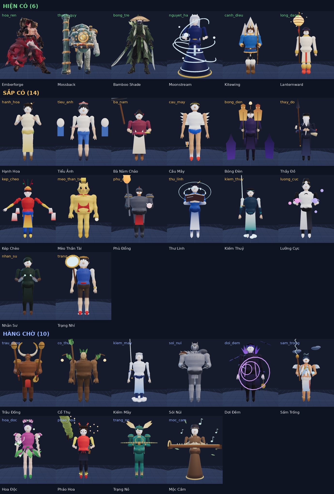

## 0. Tóm tắt

| Nhóm | Số tướng | Ý nghĩa |
|---|---|---|
| ✅ Hiện có (chơi được) | 6 | Có dữ liệu + engine chạy đủ nội tại/kỹ năng, có trong màn chọn tướng, 1v1 và 5v5 (`ALPHA` trong `src/data/heroes/index.js`). |
| 🔜 Sắp có | 14 | Đã có file dữ liệu + model, hiện trong lưới chọn tướng nhưng **bị khoá**; cơ chế riêng (`params`) mới khai báo, engine làm ở Mốc 10. |
| ⏳ Hàng chờ | 10 | Chỉ có thiết kế trong docs/04 §6 + model 3D; **chưa có file dữ liệu**. |
| **Tổng** | **30** | 30 model GLB trong `assets/heroes/`. |

| # | id | Tên | Danh hiệu | Vai | Đường | Khó | Trạng thái |
|---|---|---|---|---|---|---|---|
| 1 | `hoa_ren` | Emberforge | Blacksmith of Furnace Village | Đấu sĩ | Đền | ★ | ✅ Hiện có |
| 2 | `thach_quy` | Mossback | Guardian of the Mossy Temple | Đỡ đòn / Trợ thủ | Đền, Hỗ trợ | ★ | ✅ Hiện có |
| 3 | `bong_tre` | Bamboo Shade | Bamboo Forest Assassin | Sát thủ | Rừng | ★★ | ✅ Hiện có |
| 4 | `nguyet_ha` | Moonstream | Guide of the Moon River | Pháp sư | Giữa | ★ | ✅ Hiện có |
| 5 | `canh_dieu` | Kitewing | Windchasing Archer | Xạ thủ | Sông | ★ | ✅ Hiện có |
| 6 | `long_dang` | Lanternward | The Lamp Keeper | Trợ thủ | Hỗ trợ | ★ | ✅ Hiện có |
| 7 | `hanh_hoa` | Hạnh Hoa | Thầy Lang Mai Vàng | Trợ thủ / Đấu sĩ | Hỗ trợ | ★★ | 🔜 Sắp có |
| 8 | `tieu_anh` | Tiểu Ảnh | Cậu Bé Rối Giấy | Xạ thủ | Sông | ★★ | 🔜 Sắp có |
| 9 | `ba_nam` | Bà Năm Chảo | Bà Nội Trợ Xóm Chợ | Đấu sĩ | Đền | ★ | 🔜 Sắp có |
| 10 | `cau_may` | Cầu Mây | Chàng Đá Cầu Xóm Đình | Xạ thủ | Sông | ★★ | 🔜 Sắp có |
| 11 | `bong_den` | Bóng Đèn | Nghệ Nhân Rối Bóng | Pháp sư | Giữa | ★★★ | 🔜 Sắp có |
| 12 | `thay_do` | Thầy Đồ | Ông Đồ Chữ Nghĩa | Đấu sĩ / Pháp sư | Đền | ★★★ | 🔜 Sắp có |
| 13 | `kep_cheo` | Kép Chèo | Ông Kép Múa Hài | Đấu sĩ | Đền | ★★★ | 🔜 Sắp có |
| 14 | `meo_than_tai` | Mèo Thần Tài | Mèo Vẫy Tay Bảo Bối | Đỡ đòn / Trợ thủ | Hỗ trợ | ★★★ | 🔜 Sắp có |
| 15 | `phu_dong` | Phù Đổng | Chàng Trai Ngựa Sắt | Đỡ đòn / Đấu sĩ | Đền | ★ | 🔜 Sắp có |
| 16 | `thu_linh` | Thư Linh | Nàng Sách Cổ | Pháp sư | Giữa | ★★ | 🔜 Sắp có |
| 17 | `kiem_thuy` | Kiếm Thuỷ | Kiếm Sĩ Sông Xanh | Đấu sĩ / Sát thủ | Đền, Rừng | ★★★ | 🔜 Sắp có |
| 18 | `luong_cuc` | Lưỡng Cực | Đạo Sĩ Âm Dương | Pháp sư | Giữa | ★★★ | 🔜 Sắp có |
| 19 | `nhan_su` | Nhãn Sư | Thợ Săn Thấu Nhãn | Xạ thủ / Sát thủ | Sông | ★★★ | 🔜 Sắp có |
| 20 | `trang_nhi` | Trạng Nhí | Thám Tử Nhí Phố Cổ | Xạ thủ / Trợ thủ | Sông | ★★ | 🔜 Sắp có |
| 21 | `trau_dong` | Trâu Đồng | Chiến Binh Trống Trận | Đỡ đòn / Đấu sĩ | Đền | ★ | ⏳ Hàng chờ |
| 22 | `co_thu` | Cổ Thụ | Cây Đa Nghìn Tuổi | Đỡ đòn / Trợ thủ | Hỗ trợ | ★★ | ⏳ Hàng chờ |
| 23 | `kiem_may` | Kiếm Mây | Kiếm Khách Trên Mây | Đấu sĩ / Sát thủ | Đền, Rừng | ★★★ | ⏳ Hàng chờ |
| 24 | `soi_nui` | Sói Núi | Kẻ Tru Dưới Trăng | Đấu sĩ | Rừng, Đền | ★★ | ⏳ Hàng chờ |
| 25 | `doi_dem` | Dơi Đêm | Kẻ Săn Bằng Tiếng Vọng | Sát thủ / Pháp sư | Rừng, Giữa | ★★★ | ⏳ Hàng chờ |
| 26 | `sam_trong` | Sấm Trống | Tay Trống Gọi Mưa | Pháp sư | Giữa | ★★ | ⏳ Hàng chờ |
| 27 | `hoa_doc` | Hoa Độc | Nàng Sen Đầm Độc | Pháp sư / Trợ thủ | Giữa, Hỗ trợ | ★★ | ⏳ Hàng chờ |
| 28 | `phao_hoa` | Pháo Hoa | Cô Nàng Pháo Tết | Xạ thủ | Sông | ★★ | ⏳ Hàng chờ |
| 29 | `trang_no` | Trạng Nỏ | Xạ Thủ Nỏ Đồng | Xạ thủ | Sông | ★★ | ⏳ Hàng chờ |
| 30 | `moc_cam` | Mộc Cầm | Nhạc Sư Đàn Tranh | Trợ thủ / Pháp sư | Hỗ trợ | ★★ | ⏳ Hàng chờ |

Ký hiệu: **VL** vật lý · **P** phép · **C** chuẩn. `80 (+40/cấp) + 0.7 Phép` = 80 + 40 × (cấp kỹ năng − 1) + 0.7 × Sức mạnh phép. Hồi chiêu/tiêu hao ghi theo cấp kỹ năng (K1, K2: 6 cấp; K3: 3 cấp).

## 1. Cần sửa / chưa khớp (phát hiện khi tổng hợp)

1. **Build trỏ tới đồ không tồn tại** trong `src/data/items.js` (bị `cleanBuild` lọc bỏ âm thầm): `giay_xa_thu` (tieu_anh, cau_may, nhan_su, trang_nhi); `kiem_nhanh` (tieu_anh, ba_nam, cau_may, kiem_thuy, nhan_su, trang_nhi); `ao_giap_nhe` (tieu_anh, cau_may, nhan_su, trang_nhi); `nhan_bao_kich` (tieu_anh, cau_may, nhan_su, trang_nhi); `giay_giap` (meo_than_tai, phu_dong); `ao_giap_dong` (meo_than_tai, phu_dong); `ngoc_binh_an` (meo_than_tai, phu_dong).
2. **Mossback (`thach_quy`)**: code + model đã đổi sang "thợ lặn" (Móc Neo / Dậm Áp Suất / Xoáy Nước Sâu, nội tại Bình Dưỡng Khí) nhưng docs/04 §6.1 vẫn ghi bộ cũ (Mai Đá / Húc Núi / Chấn Địa / Đền Thiêng) và docs/09 §4.1 vẫn tả "rùa đá khổng lồ".
3. **Tên không đồng bộ**: 6 tướng Alpha dùng tên tiếng Anh (Emberforge, Mossback, Bamboo Shade, Moonstream, Kitewing, Lanternward), 24 tướng còn lại tên tiếng Việt. id vẫn tiếng Việt (`hoa_ren`, `thach_quy`…).
4. **Mèo Thần Tài**: danh hiệu trong data là "Mèo Vẫy Tay Bảo Bối", trong `tools/modelgen/heroes/meo_than_tai.mjs` là "Mèo Vẫy Tay Chiêu Tài".
5. **Build khác docs/04**: Mossback, Bamboo Shade, Kitewing, Lanternward có build trong code khác build ghi trong docs/04 §6 (code là nguồn đang chạy).
6. **docs/PROGRESS.md**: bảng thông số model chỉ có 16 tướng gốc; 14 model đợt 2 chưa được ghi. Số liệu 3 model nhập (Mossback, Emberforge, Bamboo Shade) đã thay đổi so với bảng.
7. **Model đợt 2 (14 tướng)** còn ở dạng khối nguyên thuỷ tô màu đỉnh, chưa có mặt chi tiết/texture như 3 model nhập; nên ưu tiên làm lại khi mở khoá.
8. **Hàng chờ (10 tướng)**: cần tạo `src/data/heroes/<id>.js` (dùng khuôn `hero()` trong `_make.js`) và thêm vào `HEROES` trong `index.js`; Kiếm Mây và Sói Núi dùng tài nguyên "Không" (không mana) — khuôn `_make.js` hiện mặc định `resource: 'mana'`.

## 2. ✅ Tướng hiện có (6)

### 1. Emberforge — "Blacksmith of Furnace Village" `hoa_ren`

**Trạng thái:** ✅ Hiện có · **Vai:** Đấu sĩ · **Đường:** Đền · **Độ khó:** ★ · **Đánh thường:** cận chiến

| | | | | | | | |
|---|---|---|---|---|---|---|---|
| HP 880 (+105) | Mana 300 (+32) | Công 68 (+6.5) | Giáp 30 (+3.6) | KP 30 (+2) | Tốc đánh 0.68 (+2%/cấp) | Chạy 320 | Tầm 170 |

- **Nội tại – Lò Nung** `lo_nung`: Mỗi đòn đánh hoặc kỹ năng trúng tướng +1 Nhiệt (tối đa 5, giữ 4s). Mỗi Nhiệt +5% tốc đánh. Đủ 5: đòn đánh kế tiếp gây thêm 8% HP tối đa mục tiêu (phép) và xoá Nhiệt.
- **K1 – Vung Búa** `vung_bua` · kiểu `cone` · tầm 320, góc 100°
  - Hồi chiêu: 6s · Tiêu hao: 30 mana
  - Sát thương: 70 (+35/cấp) + 1 Công VL
  - Hiệu ứng: chậm 25% 1s
- **K2 – Xỉ Sắt** `xi_sat` · kiểu `selfBuff`
  - Hồi chiêu: 12/11.5/11/10.5/10/9.5s · Tiêu hao: 40 mana
  - Khiên: 80 (+40/cấp) + 0.5 Công trong 3s
  - Hiệu ứng: bản thân: tăng tốc 20% 2s
- **K3 (chiêu cuối) – Đe Trời** `de_troi` · kiểu `aoeCircle` · tầm 600, bán kính 260, trễ 0.5s
  - Hồi chiêu: 50/44/38s · Tiêu hao: 100 mana
  - Sát thương: 200 (+120/cấp) + 1.4 Công VL
  - Hiệu ứng: choáng 1s
- **Bot:** combo K3 → K1 → K2 · giữ cự ly 170 · vào giao tranh khi HP ≥ 70%
- **Phép mặc định:** Chớp Bước · **Build:** Giày Chiến → Huyết Kiếm → Búa Thần Rèn → Khiên Đá → Thương Phá Giáp → Mặt Nạ Hồi Sinh

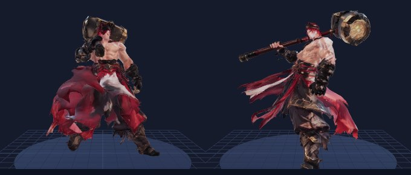

- **Ngoại hình model:** thợ rèn cơ bắp, tạp dề da cháy sém, găng tay sắt, tóc buộc cao, mắt ánh lửa, cánh tay có đường vân kim loại nóng đỏ khi tích Nhiệt. Vũ khí: búa rèn lớn, đầu búa nung đỏ, cán quấn da.
- **File:** `assets/heroes/hoa_ren/hoa_ren.glb` (1763 KB) · model nhập (`tools/modelgen/imports/hammer_pbr_20000.glb`, có texture, 3 ảnh)
- **Thông số:** 19,967 tam giác · 24 xương · 1 vật liệu · cao 250 cm · runRefSpeed 320
- **Màu:** viền sáng `#ff7a1a` · bảng màu `#2a2a2e` `#ff7a1a` `#ffd166` `#6b3b1e`
- **Clip (11):** Idle, Run, Attack1, Attack2, Cast1, Cast2, Ult, Death, Recall, Victory, Showcase

### 2. Mossback — "Guardian of the Mossy Temple" `thach_quy`

**Trạng thái:** ✅ Hiện có · **Vai:** Đỡ đòn / Trợ thủ · **Đường:** Đền, Hỗ trợ · **Độ khó:** ★ · **Đánh thường:** cận chiến

| | | | | | | | |
|---|---|---|---|---|---|---|---|
| HP 1000 (+130) | Mana 320 (+35) | Công 58 (+4.5) | Giáp 36 (+4.2) | KP 32 (+2.2) | Tốc đánh 0.62 (+1.5%/cấp) | Chạy 310 | Tầm 160 |

- **Nội tại – Bình Dưỡng Khí** `mai_da`: Sau 8s không nhận sát thương, bình dưỡng khí bơm một lớp bong bóng: khiên bằng 8% HP tối đa (không cộng dồn).
- **K1 – Móc Neo** `moc_neo` · kiểu `skillshot` · tầm 850, rộng 80, tốc đạn 1900
  - Hồi chiêu: 14/13/12/11/10/9s · Tiêu hao: 60 mana
  - Sát thương: 60 (+30/cấp) + 4% HP tối đa VL
  - Mô tả: Phóng móc neo từ đầu ống theo một hướng. Địch đầu tiên trúng móc bị kéo về sát trước mặt Mossback và choáng thêm 0.5s.
- **K2 – Dậm Áp Suất** `chan_dia` · kiểu `aoeSelf` · bán kính 300
  - Hồi chiêu: 8s · Tiêu hao: 40 mana
  - Sát thương: 50 (+25/cấp) + 4% HP tối đa P
  - Hiệu ứng: chậm 35% 1.5s
  - Mô tả: Giơ ống đồng lên rồi dộng xuống đất, bắn ra vòng sóng nước áp suất quanh mình: gây sát thương và làm chậm 35% trong 1.5s.
- **K3 (chiêu cuối) – Xoáy Nước Sâu** `den_thieng` · kiểu `aoeSelf` · bán kính 420
  - Hồi chiêu: 60/52/44s · Tiêu hao: 100 mana
  - Hiệu ứng: khiêu khích 1.5/1.75/2s; bản thân: đổi chỉ số mr 40/60/80 armor 40/60/80 5s
  - Mô tả: Cắm ống xuống đất mở xoáy nước: hút mọi địch trong vùng về sát quanh Mossback, khiêu khích chúng 1.5/1.75/2s (buộc phải đánh Mossback). Mossback +40/60/80 giáp và kháng phép trong 5s.
- **Bot:** combo K1 → K3 → K2 · giữ cự ly 160 · vào giao tranh khi HP ≥ 80%
- **Phép mặc định:** Chớp Bước · **Build:** Giày Chiến → Khiên Đá → Giáp Đèn Lồng → Giáp Gai → Tim Cổ Thụ → Áo Choàng Sương

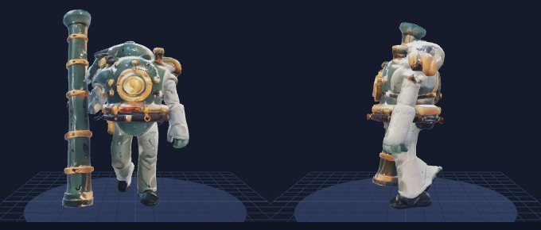

- **Ngoại hình model:** Thợ lặn canh đền chìm: bộ đồ lặn đồng thau, mũ lặn tròn, bình dưỡng khí sau lưng, vác ống đồng dài làm vũ khí (⚠️ khác mô tả "rùa đá" cũ trong docs/09 §4.1).
- **File:** `assets/heroes/thach_quy/thach_quy.glb` (2421 KB) · model nhập (`tools/modelgen/imports/diver_pbr_20000.glb`, có texture, 3 ảnh)
- **Thông số:** 19,994 tam giác · 20 xương · 1 vật liệu · cao 250 cm · runRefSpeed 310
- **Màu:** viền sáng `#ffab47` · bảng màu `#405c57` `#ff8a1e` `#a66119` `#1c302e`
- **Clip (11):** Idle, Run, Attack1, Attack2, Cast1, Cast2, Ult, Death, Recall, Victory, Showcase

### 3. Bamboo Shade — "Bamboo Forest Assassin" `bong_tre`

**Trạng thái:** ✅ Hiện có · **Vai:** Sát thủ · **Đường:** Rừng · **Độ khó:** ★★ · **Đánh thường:** cận chiến

| | | | | | | | |
|---|---|---|---|---|---|---|---|
| HP 700 (+85) | Mana 260 (+25) | Công 74 (+7.5) | Giáp 24 (+3) | KP 26 (+1.6) | Tốc đánh 0.78 (+2.8%/cấp) | Chạy 345 | Tầm 160 |

- **Nội tại – Mũi Tre** `mui_tre`: Gây thêm 15% sát thương lên tướng dưới 40% HP.
- **K1 – Lá Bay** `la_bay` · kiểu `skillshot` · tầm 700, rộng 60, tốc đạn 2000
  - Hồi chiêu: 5s · Tiêu hao: 30 mana
  - Sát thương: 60 (+30/cấp) + 0.9 Công VL
- **K2 – Lướt Đốt** `luot_dot` · kiểu `dash` · tầm 400, tốc đạn 2400
  - Hồi chiêu: 9/8.5/8/7.5/7/6.5s · Tiêu hao: 40 mana
  - Sát thương: 50 (+25/cấp) + 0.6 Công VL
- **K3 (chiêu cuối) – Rừng Nuốt Bóng** `rung_nuot_bong` · kiểu `selfBuff`
  - Hồi chiêu: 55/48/40s · Tiêu hao: 80 mana
  - Đòn phục kích: 150 (+90/cấp) + 1.2 Công thêm VL, chậm 40% 1s
  - Hiệu ứng: bản thân: tàng hình 2.5s, tăng tốc 30% 2.5s
- **Bot:** combo K3 → K1 → K2 · giữ cự ly 160 · vào giao tranh khi HP ≥ 80%
- **Phép mặc định:** Thu Hoạch · **Build:** Giày Chiến → Huyết Kiếm → Lưỡi Huyết Nguyệt → Dao Trăng Khuyết → Thương Phá Giáp → Mặt Nạ Hồi Sinh

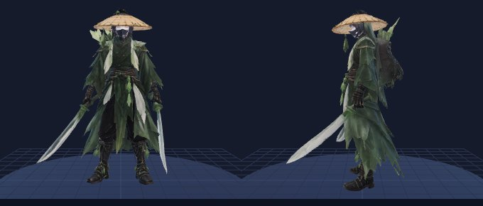

- **Ngoại hình model:** sát thủ nữ, áo bó màu lục đậm, khăn che nửa mặt, nón lá tre cắt vát, lá tre khô gắn trên vai áo. Vũ khí: hai dao ngắn hình lá tre.
- **File:** `assets/heroes/bong_tre/bong_tre.glb` (2830 KB) · model nhập (`tools/modelgen/imports/ronin_pbr_100000.glb`, có texture, 3 ảnh)
- **Thông số:** 27,732 tam giác · 24 xương · 1 vật liệu · cao 220 cm · runRefSpeed 345
- **Màu:** viền sáng `#6fbf73` · bảng màu `#1f3b2a` `#6fbf73` `#d8e8b0` `#0f1a14`
- **Clip (11):** Idle, Run, Attack1, Attack2, Cast1, Cast2, Ult, Death, Recall, Victory, Showcase

### 4. Moonstream — "Guide of the Moon River" `nguyet_ha`

**Trạng thái:** ✅ Hiện có · **Vai:** Pháp sư · **Đường:** Giữa · **Độ khó:** ★ · **Đánh thường:** đạn bay (tốc 1800)

| | | | | | | | |
|---|---|---|---|---|---|---|---|
| HP 640 (+78) | Mana 480 (+48) | Công 50 (+3.2) | Giáp 20 (+2.8) | KP 28 (+1.6) | Tốc đánh 0.62 (+1.2%/cấp) | Chạy 315 | Tầm 540 |

- **Nội tại – Triều Trăng** `trieu_trang`: Mỗi kỹ năng trúng ít nhất 1 tướng hồi 3% mana tối đa.
- **K1 – Giọt Bạc** `giot_bac` · kiểu `skillshot` · tầm 800, rộng 70, tốc đạn 1600
  - Hồi chiêu: 5s · Tiêu hao: 50 mana
  - Sát thương: 80 (+40/cấp) + 0.7 Phép P
- **K2 – Xoáy Nước** `xoay_nuoc` · kiểu `zone` · tầm 650, bán kính 220, kéo dài 2s
  - Hồi chiêu: 11/10.5/10/9.5/9/8.5s · Tiêu hao: 70 mana
  - Sát thương: 30 (+15/cấp) + 0.2 Phép P
  - Hiệu ứng: chậm 35% 0.6s
- **K3 (chiêu cuối) – Lũ Nguyệt** `lu_nguyet` · kiểu `aoeCircle` · tầm 850, bán kính 320, trễ 0.8s
  - Hồi chiêu: 55/48/40s · Tiêu hao: 120 mana
  - Sát thương: 250 (+130/cấp) + 1 Phép P
  - Hiệu ứng: hất tung 0.8s
- **Bot:** combo K2 → K3 → K1 · giữ cự ly 600 · vào giao tranh khi HP ≥ 90%
- **Phép mặc định:** Chớp Bước · **Build:** Giày Pháp Sư → Trượng Sông → Mũ Sấm → Sách Phá Giới → Bình Sương Đông → Ngọc Băng

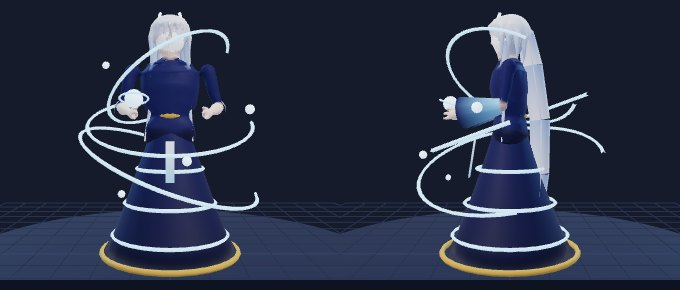

- **Ngoại hình model:** pháp sư nữ tóc bạc dài chạm đất, áo lụa xanh đêm có hoạ tiết sóng, vương miện trăng khuyết, dải lụa nước trôi quanh người. Vũ khí: không; điều khiển nước bằng tay và dải lụa.
- **File:** `assets/heroes/nguyet_ha/nguyet_ha.glb` (861 KB) · sinh bằng code (`tools/modelgen/heroes/nguyet_ha.mjs`, màu theo đỉnh, chưa texture)
- **Thông số:** 12,092 tam giác · 30 xương · 3 vật liệu · cao 178 cm · runRefSpeed 315
- **Màu:** viền sáng `#8fd3ff` · bảng màu `#1d2b64` `#8fd3ff` `#e8f4ff` `#c9a24a`
- **Clip (11):** Idle, Run, Attack1, Attack2, Cast1, Cast2, Ult, Death, Recall, Victory, Showcase

### 5. Kitewing — "Windchasing Archer" `canh_dieu`

**Trạng thái:** ✅ Hiện có · **Vai:** Xạ thủ · **Đường:** Sông · **Độ khó:** ★ · **Đánh thường:** đạn bay (tốc 2200)

| | | | | | | | |
|---|---|---|---|---|---|---|---|
| HP 620 (+82) | Mana 300 (+30) | Công 64 (+6) | Giáp 20 (+2.8) | KP 26 (+1.5) | Tốc đánh 0.72 (+3%/cấp) | Chạy 325 | Tầm 600 |

- **Nội tại – Gió Thuận** `gio_thuan`: Mỗi đòn đánh thứ 4 bắn thêm 1 mũi tên gây 50% sát thương.
- **K1 – Mũi Tên Gió** `mui_ten_gio` · kiểu `skillshot` · tầm 950, rộng 70, tốc đạn 2400
  - Hồi chiêu: 7/6.6/6.2/5.8/5.4/5s · Tiêu hao: 40 mana
  - Sát thương: 70 (+35/cấp) + 1.1 Công VL
  - Hiệu ứng: chậm 25% 1.5s
- **K2 – Lộn Diều** `lon_dieu` · kiểu `dash` · tầm 300, tốc đạn 2200
  - Hồi chiêu: 10/9.5/9/8.5/8/7.5s · Tiêu hao: 30 mana
  - Hiệu ứng: bản thân: đổi chỉ số atkSpeedPct +50% 3s
- **K3 (chiêu cuối) – Mưa Tên** `mua_ten` · kiểu `zone` · tầm 950, bán kính 300, kéo dài 2.5s
  - Hồi chiêu: 50/44/38s · Tiêu hao: 100 mana
  - Sát thương: 40 (+20/cấp) + 0.35 Công VL
  - Hiệu ứng: chậm 20% 0.5s
- **Bot:** combo K1 → K2 → K3 · giữ cự ly 550 · vào giao tranh khi HP ≥ 90%
- **Phép mặc định:** Chớp Bước · **Build:** Giày Tốc Chiến → Cung Gió → Dao Trăng Khuyết → Huyết Kiếm → Búa Thần Rèn → Mặt Nạ Hồi Sinh

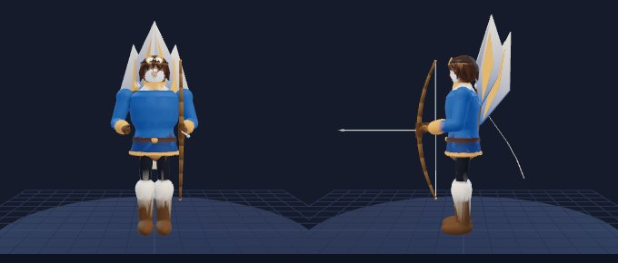

- **Ngoại hình model:** cung thủ nam trẻ, áo ngắn kiểu phi công cổ điển, kính bảo hộ đẩy lên trán, khăn quàng dài, lưng đeo diều gấp làm cánh. Vũ khí: cung gỗ tre cong với dây gió phát sáng.
- **File:** `assets/heroes/canh_dieu/canh_dieu.glb` (739 KB) · sinh bằng code (`tools/modelgen/heroes/canh_dieu.mjs`, màu theo đỉnh, chưa texture)
- **Thông số:** 10,560 tam giác · 25 xương · 3 vật liệu · cao 182 cm · runRefSpeed 325
- **Màu:** viền sáng `#a8e6ff` · bảng màu `#2b6cb0` `#f6ad55` `#fff5e1` `#1a202c`
- **Clip (11):** Idle, Run, Attack1, Attack2, Cast1, Cast2, Ult, Death, Recall, Victory, Showcase

### 6. Lanternward — "The Lamp Keeper" `long_dang`

**Trạng thái:** ✅ Hiện có · **Vai:** Trợ thủ · **Đường:** Hỗ trợ · **Độ khó:** ★ · **Đánh thường:** đạn bay (tốc 1700)

| | | | | | | | |
|---|---|---|---|---|---|---|---|
| HP 720 (+95) | Mana 440 (+42) | Công 48 (+3) | Giáp 24 (+3.2) | KP 30 (+2) | Tốc đánh 0.62 (+1.2%/cấp) | Chạy 315 | Tầm 520 |

- **Nội tại – Ánh Lửa Nhỏ** `anh_lua_nho`: Đồng minh trong bán kính 500 hồi 0.5% HP tối đa mỗi giây.
- **K1 – Đèn Trôi** `den_troi` · kiểu `skillshot` · tầm 700, rộng 80, tốc đạn 1400
  - Hồi chiêu: 9/8.6/8.2/7.8/7.4/7s · Tiêu hao: 50 mana
  - Sát thương: 60 (+30/cấp) + 0.5 Phép P
  - Hiệu ứng: choáng 1s
- **K2 – Thắp Sáng** `thap_sang` · kiểu `allyTarget` · tầm 600
  - Hồi chiêu: 10/9.6/9.2/8.8/8.4/8s · Tiêu hao: 70 mana
  - Hồi máu: 80 (+40/cấp) + 0.6 Phép
  - Khiên: 60 (+30/cấp) + 0.4 Phép trong 3s
- **K3 (chiêu cuối) – Hội Đèn** `hoi_den` · kiểu `aoeSelf` · bán kính 650
  - Hồi chiêu: 70/62/54s · Tiêu hao: 120 mana
  - Khiên đồng minh: 200 (+100/cấp) + 0.8 Phép trong 4s
  - Hiệu ứng: đồng minh: tăng tốc 25% 3s
- **Bot:** combo K2 → K1 → K3 · giữ cự ly 520 · vào giao tranh khi HP ≥ 80%
- **Phép mặc định:** Hồi Phục · **Build:** Giày Tĩnh Tâm → Giáp Đèn Lồng → Áo Choàng Sương → Trượng Sông → Khiên Đá → Tim Cổ Thụ

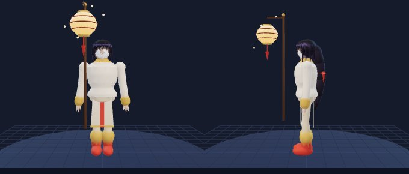

- **Ngoại hình model:** cô gái dịu dàng, áo dài trắng ngà viền vàng, tóc đen dài thắt dải lụa, cầm đèn lồng giấy lớn phát sáng ấm, đom đóm bay quanh. Vũ khí: đèn lồng treo trên cán gỗ dài.
- **File:** `assets/heroes/long_dang/long_dang.glb` (756 KB) · sinh bằng code (`tools/modelgen/heroes/long_dang.mjs`, màu theo đỉnh, chưa texture)
- **Thông số:** 10,938 tam giác · 26 xương · 3 vật liệu · cao 172 cm · runRefSpeed 315
- **Màu:** viền sáng `#ffc15e` · bảng màu `#fff4e0` `#ffc15e` `#e0513b` `#2b2b52`
- **Clip (11):** Idle, Run, Attack1, Attack2, Cast1, Cast2, Ult, Death, Recall, Victory, Showcase

## 3. 🔜 Tướng sắp có (14)

### 7. Hạnh Hoa — "Thầy Lang Mai Vàng" `hanh_hoa`

**Trạng thái:** 🔜 Sắp có (khoá trong màn chọn tướng) · **Vai:** Trợ thủ / Đấu sĩ · **Đường:** Hỗ trợ · **Độ khó:** ★★ · **Đánh thường:** cận chiến

*Cơ chế: thầy thuốc cận chiến, đánh tích nội lực để hồi máu, chiêu cuối mở trạng thái bùng nổ.*

| | | | | | | | |
|---|---|---|---|---|---|---|---|
| HP 720 (+92) | Mana 420 (+42) | Công 62 (+3.6) | Giáp 26 (+3.2) | KP 30 (+1.8) | Tốc đánh 0.62 (+1.2%/cấp) | Chạy 325 | Tầm 170 |

- **Nội tại – Nụ Mai** `nu_mai`: Mỗi đòn đánh trúng tướng tích 1 Nụ (tối đa 4, giữ 5s). Đủ 4 Nụ: đòn kế tiếp gây thêm 50 (+0.3 Công) phép và hồi cho Hạnh Hoa 6% HP tối đa.
- **K1 – Đấm Mai** `dam_mai` · kiểu `dash` · tầm 380
  - Hồi chiêu: 7/6.6/6.2/5.8/5.4/5s · Tiêu hao: 40/40/45/45/50/50 mana
  - Sát thương: 80 (+40/cấp) + 0.9 Công VL
  - Mô tả: Lao tới và đấm sát thương tuyến đường; tích 1 Nụ.
- **K2 – Châm Cứu** `cham_cuu` · kiểu `allyTarget` · tầm 700
  - Hồi chiêu: 10/9.5/9/8.5/8/7.5s · Tiêu hao: 60/65/70/75/80/85 mana
  - Hồi máu: 130 (+50/cấp) + 0.6 Phép
  - Hiệu ứng: xoá khống chế
  - Mô tả: Hồi máu đồng minh (hoặc chính mình) và xoá khống chế.
- **K3 (chiêu cuối) – Ấn Trăm Mai** `an_tram_mai` · kiểu `selfBuff` · kéo dài 8s
  - Hồi chiêu: 70/60/50s · Tiêu hao: 100 mana
  - Hiệu ứng: đổi chỉ số tenacity +30% hotPctPerSec +3% atkPct +30%
  - Mô tả: 8 giây: +30% Công, hồi 3% HP mỗi giây, kháng hiệu ứng 30%.
- **Bot:** combo K1 → K3 → K2 · giữ cự ly 170 · vào giao tranh khi HP ≥ 70%
- **Phép mặc định:** Chớp Bước · **Build:** Giày Chiến → Búa Thần Rèn → Huyết Kiếm → Khiên Đá → Thương Phá Giáp → Mặt Nạ Hồi Sinh

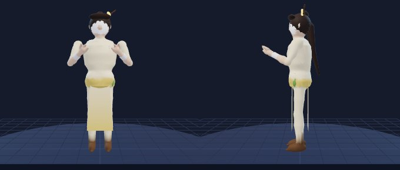

- **Ngoại hình model:** Thầy lang nữ áo kem/vàng mai, bầu thuốc xanh đeo hông, ba cặp kim châm trên ngực, đấm tay không.
- **File:** `assets/heroes/hanh_hoa/hanh_hoa.glb` (660 KB) · sinh bằng code (`tools/modelgen/heroes/hanh_hoa.mjs`, màu theo đỉnh, chưa texture)
- **Thông số:** 10,124 tam giác · 24 xương · 3 vật liệu · cao 172 cm · runRefSpeed 325
- **Màu:** viền sáng `#f2c14e` · bảng màu `#f6e9c4` `#f2c14e` `#6b4a2a` `#7fae5a`
- **Clip (11):** Idle, Run, Attack1, Attack2, Cast1, Cast2, Ult, Death, Recall, Victory, Showcase

### 8. Tiểu Ảnh — "Cậu Bé Rối Giấy" `tieu_anh`

**Trạng thái:** 🔜 Sắp có (khoá trong màn chọn tướng) · **Vai:** Xạ thủ · **Đường:** Sông · **Độ khó:** ★★ · **Đánh thường:** đạn bay (tốc 1900, vfx `paper_dart`)

*Cơ chế: đánh xa, phân thân giấy, tích Hứng để tung đòn xoáy.*

| | | | | | | | |
|---|---|---|---|---|---|---|---|
| HP 640 (+78) | Mana 300 (+30) | Công 66 (+5.5) | Giáp 22 (+3) | KP 26 (+1.5) | Tốc đánh 0.75 (+3%/cấp) | Chạy 330 | Tầm 500 |

- **Nội tại – Xoáy Nhỏ** `xoay_nho`: Mỗi lần trúng tướng +1 Hứng. Đủ 20 Hứng: đòn đánh kế tiếp thành Xoáy Nhỏ 120 (+0.6 Công) phép, hất lùi nhẹ.
- **K1 – Phi Tiêu Giấy** `phi_tieu_giay` · kiểu `skillshot` · tầm 850, rộng 60, tốc đạn 1800
  - Hồi chiêu: 5/4.7/4.4/4.1/3.8/3.5s · Tiêu hao: 40/42/44/46/48/50 mana
  - Sát thương: 70 (+35/cấp) + 0.9 Công VL
  - Mô tả: 25% số phát thành Pháo Giấy nổ vùng 200, sát thương tối đa ở tâm.
- **K2 – Phân Thân Giấy** `phan_than_giay` · kiểu `recast` · tầm 500
  - Hồi chiêu: 13/12/11/10/9/8s · Tiêu hao: 60 mana
  - Sát thương: 40 (+20/cấp) + 0.5 Công VL
  - Mô tả: Tung 2 phân thân giấy đánh địch trong 4s; kích hoạt lại để đổi chỗ với một phân thân.
- **K3 (chiêu cuối) – Xoáy Gió** `xoay_gio` · kiểu `dash` · tầm 550
  - Hồi chiêu: 55/47/40s · Tiêu hao: 100 mana
  - Sát thương: 180 (+100/cấp) + 1.1 Công P
  - Hiệu ứng: đẩy lùi 220
  - Mô tả: Lao dọc theo hướng, nổ xoáy khi chạm tướng.
- **Bot:** combo K2 → K1 → K3 · giữ cự ly 480 · vào giao tranh khi HP ≥ 85%
- **Phép mặc định:** Chớp Bước · **Build:** ⚠️`giay_xa_thu` (không có trong items.js) → Cung Gió → ⚠️`kiem_nhanh` (không có trong items.js) → ⚠️`ao_giap_nhe` (không có trong items.js) → ⚠️`nhan_bao_kich` (không có trong items.js) → Mặt Nạ Hồi Sinh

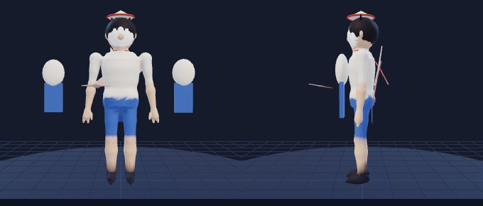

- **Ngoại hình model:** Cậu bé thấp (1.5 m), mũ giấy hình nón, phi tiêu giấy lớn đeo sau lưng, vài phân thân giấy nhỏ bên cạnh.
- **File:** `assets/heroes/tieu_anh/tieu_anh.glb` (630 KB) · sinh bằng code (`tools/modelgen/heroes/tieu_anh.mjs`, màu theo đỉnh, chưa texture)
- **Thông số:** 9,698 tam giác · 23 xương · 2 vật liệu · cao 150 cm · runRefSpeed 330
- **Màu:** viền sáng `#ff8a7a` · bảng màu `#f7f1e3` `#d64a3a` `#2a2a3a` `#4a78c8`
- **Clip (11):** Idle, Run, Attack1, Attack2, Cast1, Cast2, Ult, Death, Recall, Victory, Showcase

### 9. Bà Năm Chảo — "Bà Nội Trợ Xóm Chợ" `ba_nam`

**Trạng thái:** 🔜 Sắp có (khoá trong màn chọn tướng) · **Vai:** Đấu sĩ · **Đường:** Đền · **Độ khó:** ★ · **Đánh thường:** cận chiến

*Cơ chế: cận chiến chí mạng tích dần, mắng xối phản lại đạn bay.*

| | | | | | | | |
|---|---|---|---|---|---|---|---|
| HP 900 (+102) | Mana 300 (+32) | Công 70 (+6.8) | Giáp 28 (+3.4) | KP 28 (+1.9) | Tốc đánh 0.7 (+2.5%/cấp) | Chạy 335 | Tầm 165 |

- **Nội tại – Chiêu Chảo** `chieu_chao`: Mỗi đòn đánh trúng +4% tỉ lệ chí mạng (tối đa +36%, giữ 6s); chí mạng gây 210% sát thương.
- **K1 – Đập Chảo** `dap_chao` · kiểu `cone` · tầm 320, góc 100°
  - Hồi chiêu: 6/5.6/5.2/4.8/4.4/4s · Tiêu hao: 30/30/35/35/40/40 mana
  - Sát thương: 75 (+40/cấp) + 1 Công VL
  - Hiệu ứng: chậm 25% 1s
  - Mô tả: Vung chảo hình quạt, làm chậm 25% trong 1s.
- **K2 – Mắng Xối** `mang_xoi` · kiểu `aoeSelf` · bán kính 380
  - Hồi chiêu: 16/15/14/13/12/11s · Tiêu hao: 60 mana
  - Sát thương: 20 (+10/cấp) + 0.25 Công VL
  - Mô tả: 5 đợt sóng xung kích trong 1s; đạn bay chạm sóng bị phản ngược về phía địch.
- **K3 (chiêu cuối) – Dép Bay** `dep_bay` · kiểu `targetedDash` · tầm 650
  - Hồi chiêu: 45/40/35s · Tiêu hao: 90 mana
  - Sát thương: 190 (+90/cấp) + 1.2 Công VL
  - Hiệu ứng: choáng 1s
  - Mô tả: Lao đá vào mục tiêu đã khoá: choáng 1s, tích thêm 3 chí mạng.
- **Bot:** combo K3 → K1 → K2 · giữ cự ly 160 · vào giao tranh khi HP ≥ 75%
- **Phép mặc định:** Chớp Bước · **Build:** Giày Chiến → ⚠️`kiem_nhanh` (không có trong items.js) → Huyết Kiếm → Khiên Đá → Thương Phá Giáp → Mặt Nạ Hồi Sinh

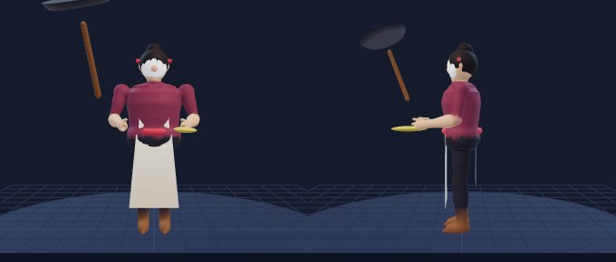

- **Ngoại hình model:** Bà nội trợ, lô uốn tóc hai bên, lông mày cau, chảo lớn tay phải, chiếc dép tay trái.
- **File:** `assets/heroes/ba_nam/ba_nam.glb` (597 KB) · sinh bằng code (`tools/modelgen/heroes/ba_nam.mjs`, màu theo đỉnh, chưa texture)
- **Thông số:** 9,758 tam giác · 21 xương · 2 vật liệu · cao 160 cm · runRefSpeed 335
- **Màu:** viền sáng `#ff7a8a` · bảng màu `#8a3a52` `#f2ead8` `#2b2b30` `#e04a5a`
- **Clip (11):** Idle, Run, Attack1, Attack2, Cast1, Cast2, Ult, Death, Recall, Victory, Showcase

### 10. Cầu Mây — "Chàng Đá Cầu Xóm Đình" `cau_may`

**Trạng thái:** 🔜 Sắp có (khoá trong màn chọn tướng) · **Vai:** Xạ thủ · **Đường:** Sông · **Độ khó:** ★★ · **Đánh thường:** đạn bay (tốc 1700, vfx `shuttlecock`)

*Cơ chế: sút xa, chưa sung thì hay trượt, dưới 35% máu nổi Cánh Sếu mạnh hơn hẳn.*

| | | | | | | | |
|---|---|---|---|---|---|---|---|
| HP 640 (+78) | Mana 300 (+30) | Công 66 (+5.5) | Giáp 22 (+3) | KP 26 (+1.5) | Tốc đánh 0.75 (+3%/cấp) | Chạy 320 | Tầm 520 |

- **Nội tại – Cánh Sếu** `canh_seu`: Dưới 35% HP tối đa: giảm 35% sát thương nhận, +50% tốc ra chiêu, kháng hiệu ứng 40%, cho đến khi hồi lên trên 50%.
- **K1 – Tạt Cầu** `tat_cau` · kiểu `skillshot` · tầm 800, rộng 50, tốc đạn 1800
  - Hồi chiêu: 4/3.8/3.6/3.4/3.2/3s · Tiêu hao: 30/30/35/35/40/40 mana
  - Sát thương: 60 (+30/cấp) + 0.8 Công VL
  - Mô tả: 30% số phát thành Đá Lộn Ngược 140 sát thương kèm choáng ngắn.
- **K2 – Đá Xoáy Lửa** `da_xoay_lua` · kiểu `skillshot` · tầm 900, rộng 70, tốc đạn 2100
  - Hồi chiêu: 9/8.5/8/7.5/7/6.5s · Tiêu hao: 55/55/60/60/65/65 mana
  - Sát thương: 90 (+45/cấp) + 1 Công VL
  - Hiệu ứng: sát thương theo thời gian 25/s 3s
  - Mô tả: Quả cầu xoáy gây cháy 3s.
- **K3 (chiêu cuối) – Song Cầu Thắng** `song_cau_thang` · kiểu `skillshot` · tầm 950, rộng 90, tốc đạn 2400
  - Hồi chiêu: 42/36/30s · Tiêu hao: 90 mana
  - Sát thương: 130 (+70/cấp) + 0.9 Công VL
  - Mô tả: Hai phát liên tiếp, phát thứ hai theo dấu phát đầu.
- **Bot:** combo K3 → K2 → K1 · giữ cự ly 520 · vào giao tranh khi HP ≥ 90%
- **Phép mặc định:** Chớp Bước · **Build:** ⚠️`giay_xa_thu` (không có trong items.js) → Cung Gió → ⚠️`kiem_nhanh` (không có trong items.js) → ⚠️`ao_giap_nhe` (không có trong items.js) → ⚠️`nhan_bao_kich` (không có trong items.js) → Mặt Nạ Hồi Sinh

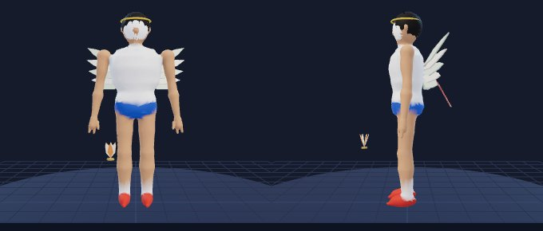

- **Ngoại hình model:** Chàng trai áo trắng–xanh, cánh sếu lông vũ trên lưng, quả cầu mây (đế xu + lông) bay cạnh chân phải.
- **File:** `assets/heroes/cau_may/cau_may.glb` (662 KB) · sinh bằng code (`tools/modelgen/heroes/cau_may.mjs`, màu theo đỉnh, chưa texture)
- **Thông số:** 9,670 tam giác · 23 xương · 2 vật liệu · cao 178 cm · runRefSpeed 320
- **Màu:** viền sáng `#6fd6a0` · bảng màu `#fafafa` `#2d6fd6` `#ffd23a` `#d9412f`
- **Clip (11):** Idle, Run, Attack1, Attack2, Cast1, Cast2, Ult, Death, Recall, Victory, Showcase

### 11. Bóng Đèn — "Nghệ Nhân Rối Bóng" `bong_den`

**Trạng thái:** 🔜 Sắp có (khoá trong màn chọn tướng) · **Vai:** Pháp sư · **Đường:** Giữa · **Độ khó:** ★★★ · **Đánh thường:** đạn bay (tốc 1700, vfx `shadow_dart`)

*Cơ chế: khống chế bằng bóng, trói cổ rồi choáng, mở lãnh địa rối bóng làm cả nhóm địch chậm.*

| | | | | | | | |
|---|---|---|---|---|---|---|---|
| HP 650 (+80) | Mana 470 (+46) | Công 50 (+3.2) | Giáp 21 (+2.8) | KP 28 (+1.6) | Tốc đánh 0.62 (+1.2%/cấp) | Chạy 315 | Tầm 500 |

- **Nội tại – Bóng Sau Lưng** `bong_sau_lung`: Sát thương gây từ sau lưng mục tiêu +30%. Đứng yên 2s hồi 4% mana mỗi giây.
- **K1 – Phi Tiêu Bóng** `phi_tieu_bong` · kiểu `skillshot` · tầm 800, rộng 55, tốc đạn 1900
  - Hồi chiêu: 5/4.7/4.4/4.1/3.8/3.5s · Tiêu hao: 40/42/44/46/48/50 mana
  - Sát thương: 35 (+20/cấp) + 0.4 Phép P
  - Hiệu ứng: sát thương theo thời gian 12/s 3s
  - Mô tả: Hai phi tiêu, mỗi cái kèm chảy máu 3s.
- **K2 – Trói Bóng** `troi_bong` · kiểu `tether` · tầm 700, kéo dài 2s
  - Hồi chiêu: 12/11.5/11/10.5/10/9.5s · Tiêu hao: 70/70/75/75/80/80 mana
  - Sát thương: 60 (+30/cấp) + 0.5 Phép P
  - Hiệu ứng: trói 2s, choáng 0.8s khi hết thời gian
  - Mô tả: Bóng quấn cổ 2s (trói, sát thương theo thời gian) rồi choáng 0.8s nếu còn trong tầm.
- **K3 (chiêu cuối) – Lãnh Địa Bóng** `lanh_dia_bong` · kiểu `zone` · tầm 600, bán kính 480, kéo dài 5s
  - Hồi chiêu: 70/62/54s · Tiêu hao: 120 mana
  - Sát thương: 30 (+20/cấp) + 0.25 Phép P
  - Hiệu ứng: chậm 40% 0.6s, cấm lướt
  - Mô tả: Vùng rối bóng 5s: địch bên trong chậm 40% và không thể lướt.
- **Bot:** combo K3 → K2 → K1 · giữ cự ly 520 · vào giao tranh khi HP ≥ 90%
- **Phép mặc định:** Chớp Bước · **Build:** Giày Pháp Sư → Trượng Sông → Mũ Sấm → Sách Phá Giới → Bình Sương Đông → Ngọc Băng

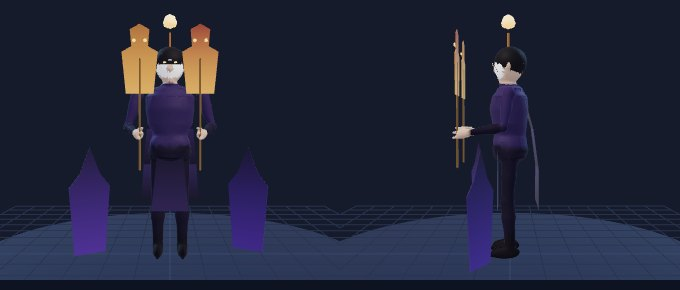

- **Ngoại hình model:** Nghệ nhân rối bóng tím–cam, mặt nạ che mắt, đèn nhỏ trên đầu, hai con rối da trên que tre, bóng đen trôi quanh.
- **File:** `assets/heroes/bong_den/bong_den.glb` (648 KB) · sinh bằng code (`tools/modelgen/heroes/bong_den.mjs`, màu theo đỉnh, chưa texture)
- **Thông số:** 9,548 tam giác · 24 xương · 3 vật liệu · cao 172 cm · runRefSpeed 315
- **Màu:** viền sáng `#b08aff` · bảng màu `#3a2a5a` `#ffb85a` `#b8763a` `#0e0a18`
- **Clip (11):** Idle, Run, Attack1, Attack2, Cast1, Cast2, Ult, Death, Recall, Victory, Showcase

### 12. Thầy Đồ — "Ông Đồ Chữ Nghĩa" `thay_do`

**Trạng thái:** 🔜 Sắp có (khoá trong màn chọn tướng) · **Vai:** Đấu sĩ / Pháp sư · **Đường:** Đền · **Độ khó:** ★★★ · **Đánh thường:** cận chiến

*Cơ chế: tiến hoá theo điểm Học, ba cấp Nghĩa; mỗi cấp mạnh và tầm xa hơn.*

| | | | | | | | |
|---|---|---|---|---|---|---|---|
| HP 860 (+102) | Mana 300 (+32) | Công 62 (+6.8) | Giáp 28 (+3.4) | KP 28 (+1.9) | Tốc đánh 0.7 (+2.5%/cấp) | Chạy 320 | Tầm 200 |

- **Nội tại – Điểm Học** `diem_hoc`: Đòn đánh và kỹ năng trúng tướng +1 Điểm. 12 Điểm: lên Nghĩa II (+15% tốc đánh, +40 tầm, đòn đánh +25 phép). 30 Điểm: Nghĩa III (+30% sát thương kỹ năng, đòn đánh xuyên 1 mục tiêu).
- **K1 – Nét Bút** `net_but` · kiểu `line` · tầm 650, rộng 110
  - Hồi chiêu: 6/5.6/5.2/4.8/4.4/4s · Tiêu hao: 40/40/45/45/50/50 mana
  - Sát thương: 70 (+35/cấp) + 0.5 Công + 0.5 Phép P
  - Mô tả: Vạch một nét mực thẳng; ở Nghĩa II để lại vệt chậm 1s.
- **K2 – Quyết Sách** `quyet_sach` · kiểu `selfBuff` · kéo dài 5s
  - Hồi chiêu: 16/15/14/13/12/11s · Tiêu hao: 50 mana
  - Khiên: 90 (+40/cấp) + 0.4 Phép
  - Hiệu ứng: tăng tốc 20% 2s
  - Mô tả: Khiên 5s, +20% tốc chạy 2s; +2 Điểm.
- **K3 (chiêu cuối) – Đứng Một Mình** `dung_mot_minh` · kiểu `selfBuff` · kéo dài 6s
  - Hồi chiêu: 75/65/55s · Tiêu hao: 100 mana
  - Hiệu ứng: đổi chỉ số atkPct +25% dmgReducePct +25% tenacity +50%
  - Mô tả: 6s: kháng hiệu ứng 50%, giảm 25% sát thương nhận, +25% Công; nhận 6 Điểm.
- **Bot:** combo K1 → K2 → K3 · giữ cự ly 200 · vào giao tranh khi HP ≥ 70%
- **Phép mặc định:** Chớp Bước · **Build:** Giày Chiến → Búa Thần Rèn → Huyết Kiếm → Khiên Đá → Thương Phá Giáp → Mặt Nạ Hồi Sinh

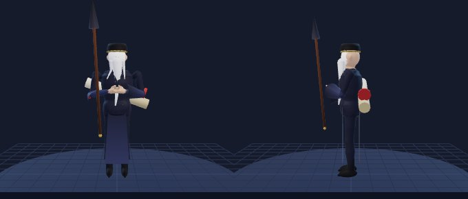

- **Ngoại hình model:** Ông đồ áo the xanh đen, khăn xếp, bút lông khổng lồ, cuộn giấy đeo sau lưng.
- **File:** `assets/heroes/thay_do/thay_do.glb` (706 KB) · sinh bằng code (`tools/modelgen/heroes/thay_do.mjs`, màu theo đỉnh, chưa texture)
- **Thông số:** 9,574 tam giác · 28 xương · 2 vật liệu · cao 175 cm · runRefSpeed 320
- **Màu:** viền sáng `#c9a24a` · bảng màu `#1e2238` `#c9a24a` `#f2e8cc` `#b8322a`
- **Clip (11):** Idle, Run, Attack1, Attack2, Cast1, Cast2, Ult, Death, Recall, Victory, Showcase

### 13. Kép Chèo — "Ông Kép Múa Hài" `kep_cheo`

**Trạng thái:** 🔜 Sắp có (khoá trong màn chọn tướng) · **Vai:** Đấu sĩ · **Đường:** Đền · **Độ khó:** ★★★ · **Đánh thường:** cận chiến

*Cơ chế: đánh có tỉ lệ choáng, sáu tia sáng đẩy lùi, chiêu cuối đổi vai (hoán đổi máu) khi sắp chết.*

| | | | | | | | |
|---|---|---|---|---|---|---|---|
| HP 860 (+102) | Mana 300 (+32) | Công 68 (+6.8) | Giáp 28 (+3.4) | KP 28 (+1.9) | Tốc đánh 0.7 (+2.5%/cấp) | Chạy 325 | Tầm 175 |

- **Nội tại – Hào Quang Sân Khấu** `hao_quang_san_khau`: Địch trong 400 quanh Kép Chèo có 10% đòn đánh trượt; bản thân +8% tốc đánh khi có địch trong vùng. Đòn đánh 25% kèm choáng 0.3s.
- **K1 – Quyền Chèo** `quyen_cheo` · kiểu `cone` · tầm 300, góc 110°
  - Hồi chiêu: 5/4.7/4.4/4.1/3.8/3.5s · Tiêu hao: 30/30/35/35/40/40 mana
  - Sát thương: 65 (+35/cấp) + 0.9 Công VL
  - Mô tả: Ba đòn quyền liên tiếp trước mặt.
- **K2 – Sáu Tia Sáng** `sau_tia_sang` · kiểu `cone` · tầm 700, góc 60°
  - Hồi chiêu: 11/10.5/10/9.5/9/8.5s · Tiêu hao: 60/60/65/65/70/70 mana
  - Sát thương: 25 (+12/cấp) + 0.3 Công P
  - Hiệu ứng: đẩy lùi 140
  - Mô tả: Bắn xối 6 tia, mỗi tia đẩy lùi; trúng đủ 3 tia thì địch kiệt sức (chậm mạnh 1.5s).
- **K3 (chiêu cuối) – Đổi Vai** `doi_vai` · kiểu `skillshot` · tầm 750, rộng 80, tốc đạn 2200
  - Hồi chiêu: 90/80/70s · Tiêu hao: 80 mana
  - Mô tả: Khi HP dưới 30%: bắn tia đổi vai. Trúng thì hai bên đổi phần trăm máu rồi cùng về ít nhất 20%; trượt thì Kép Chèo còn 10% máu.
- **Bot:** combo K1 → K2 → K3 · giữ cự ly 200 · vào giao tranh khi HP ≥ 70% · luật chiêu cuối `hpBelow0.3`
- **Phép mặc định:** Chớp Bước · **Build:** Giày Chiến → Búa Thần Rèn → Huyết Kiếm → Khiên Đá → Thương Phá Giáp → Mặt Nạ Hồi Sinh

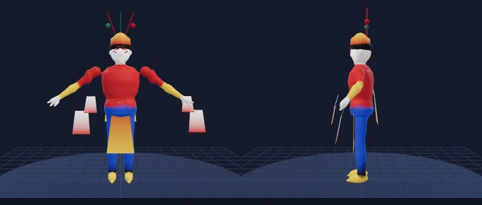

- **Ngoại hình model:** Kép chèo áo đỏ–vàng–lục, mũ chèo vàng viền đỏ cắm 3 lông trĩ, tay áo múa dài (thuỷ tụ).
- **File:** `assets/heroes/kep_cheo/kep_cheo.glb` (672 KB) · sinh bằng code (`tools/modelgen/heroes/kep_cheo.mjs`, màu theo đỉnh, chưa texture)
- **Thông số:** 9,388 tam giác · 27 xương · 2 vật liệu · cao 180 cm · runRefSpeed 325
- **Màu:** viền sáng `#f0c040` · bảng màu `#c8302a` `#f0c040` `#2a8a5a` `#181418`
- **Clip (11):** Idle, Run, Attack1, Attack2, Cast1, Cast2, Ult, Death, Recall, Victory, Showcase

### 14. Mèo Thần Tài — "Mèo Vẫy Tay Bảo Bối" `meo_than_tai`

**Trạng thái:** 🔜 Sắp có (khoá trong màn chọn tướng) · **Vai:** Đỡ đòn / Trợ thủ · **Đường:** Hỗ trợ · **Độ khó:** ★★★ · **Đánh thường:** cận chiến

*Cơ chế: khống chế bằng bảo bối, cánh chong chóng thoát hiểm, chiêu cuối tua ngược thời gian.*

| | | | | | | | |
|---|---|---|---|---|---|---|---|
| HP 1000 (+130) | Mana 320 (+35) | Công 52 (+4.5) | Giáp 40 (+4.2) | KP 32 (+2.2) | Tốc đánh 0.62 (+1.5%/cấp) | Chạy 310 | Tầm 165 |

- **Nội tại – Chong Chóng Thoát Hiểm** `chong_chong`: Bị khống chế cứng: bay lên 1.5s, gỡ khống chế và +30% tốc chạy (hồi 25s).
- **K1 – Nện Bụng** `nen_bung` · kiểu `cone` · tầm 260, góc 100°
  - Hồi chiêu: 6/5.6/5.2/4.8/4.4/4s · Tiêu hao: 30/30/35/35/40/40 mana
  - Sát thương: 60 (+30/cấp) + 0.8 Công VL
  - Hiệu ứng: đẩy lùi 100
  - Mô tả: Húc bụng: đẩy lùi; đòn thứ ba của mỗi chuỗi choáng 0.6s.
- **K2 – Súng Hơi** `sung_hoi` · kiểu `skillshot` · tầm 750, rộng 90, tốc đạn 1700
  - Hồi chiêu: 10/9.5/9/8.5/8/7.5s · Tiêu hao: 55/55/60/60/65/65 mana
  - Sát thương: 70 (+35/cấp) + 0.5 Phép P
  - Hiệu ứng: đẩy lùi 260, cắt chiêu
  - Mô tả: Vòng khí nén: đẩy lùi, cắt ngang chiêu đang gồng.
- **K3 (chiêu cuối) – Đồng Hồ Ngược** `dong_ho_nguoc` · kiểu `selfBuff`
  - Hồi chiêu: 130/110/90s · Tiêu hao: 100 mana
  - Mô tả: Tua ngược 4s: quay lại vị trí và máu của 4 giây trước (không hồi thêm khi HP hiện tại cao hơn).
- **Bot:** combo K2 → K1 · giữ cự ly 180 · vào giao tranh khi HP ≥ 60% · luật chiêu cuối `hpBelow0.25`
- **Phép mặc định:** Chớp Bước · **Build:** ⚠️`giay_giap` (không có trong items.js) → Khiên Đá → ⚠️`ao_giap_dong` (không có trong items.js) → ⚠️`ngoc_binh_an` (không có trong items.js) → Giáp Gai → Mặt Nạ Hồi Sinh

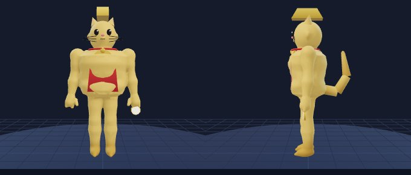

- **Ngoại hình model:** Mèo vàng đứng hai chân (1.35 m), vòng cổ đỏ + chuông, thỏi vàng trên đầu, túi bụng, đuôi mèo, đồng hồ cát tay trái.
- **File:** `assets/heroes/meo_than_tai/meo_than_tai.glb` (607 KB) · sinh bằng code (`tools/modelgen/heroes/meo_than_tai.mjs`, màu theo đỉnh, chưa texture)
- **Thông số:** 8,970 tam giác · 23 xương · 2 vật liệu · cao 135 cm · runRefSpeed 278
- **Màu:** viền sáng `#f0c040` · bảng màu `#f0c45a` `#f0c040` `#d63a30` `#3a78c8`
- **Clip (11):** Idle, Run, Attack1, Attack2, Cast1, Cast2, Ult, Death, Recall, Victory, Showcase

### 15. Phù Đổng — "Chàng Trai Ngựa Sắt" `phu_dong`

**Trạng thái:** 🔜 Sắp có (khoá trong màn chọn tướng) · **Vai:** Đỡ đòn / Đấu sĩ · **Đường:** Đền · **Độ khó:** ★ · **Đánh thường:** cận chiến

*Cơ chế: tướng đỡ đòn cứng cáp, giáp sắt giảm sát thương vật lý, phun lửa, thổi băng, lao từ trời xuống.*

| | | | | | | | |
|---|---|---|---|---|---|---|---|
| HP 1000 (+130) | Mana 320 (+35) | Công 64 (+4.5) | Giáp 36 (+4.2) | KP 32 (+2.2) | Tốc đánh 0.62 (+1.5%/cấp) | Chạy 325 | Tầm 170 |

- **Nội tại – Giáp Sắt** `giap_sat`: Giảm 20% sát thương vật lý và 40% lực đẩy; sát thương phép, đốt, độc và theo %HP vẫn nhận đủ.
- **K1 – Lửa Ngựa Sắt** `lua_ngua_sat` · kiểu `line` · tầm 700, rộng 120
  - Hồi chiêu: 8/7.5/7/6.5/6/5.5s · Tiêu hao: 45/45/50/50/55/55 mana
  - Sát thương: 25 (+12/cấp) + 0.25 Công + 0.2 Phép P
  - Hiệu ứng: sát thương theo thời gian 30/s 3s
  - Mô tả: Hai tia lửa bốn nhịp; trúng đủ bốn nhịp thì địch bốc cháy 3s.
- **K2 – Gió Băng Núi Sóc** `gio_bang_nui_soc` · kiểu `cone` · tầm 550, góc 70°
  - Hồi chiêu: 12/11.5/11/10.5/10/9.5s · Tiêu hao: 60/60/65/65/70/70 mana
  - Sát thương: 60 (+30/cấp) + 0.4 Phép P
  - Hiệu ứng: choáng 0.8s đóng băng, chậm 45% 2s
  - Mô tả: Luồng hơi nón: đóng băng 0.8s rồi làm chậm nặng.
- **K3 (chiêu cuối) – Bay Lên Trời** `bay_len_troi` · kiểu `aoeCircle` · tầm 900, bán kính 300, trễ 0.9s
  - Hồi chiêu: 60/52/44s · Tiêu hao: 100 mana
  - Sát thương: 220 (+110/cấp) + 1 Công VL
  - Hiệu ứng: hất tung 0.8s
  - Mô tả: Bay lên rồi lao xuống điểm chỉ định: không thể chọn khi bay, hất tung mục tiêu ở tâm, vùng chấn động quanh điểm rơi.
- **Bot:** combo K3 → K2 → K1 · giữ cự ly 190 · vào giao tranh khi HP ≥ 70%
- **Phép mặc định:** Chớp Bước · **Build:** ⚠️`giay_giap` (không có trong items.js) → Khiên Đá → ⚠️`ao_giap_dong` (không có trong items.js) → ⚠️`ngoc_binh_an` (không có trong items.js) → Giáp Gai → Mặt Nạ Hồi Sinh

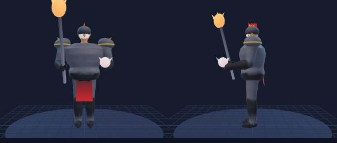

- **Ngoại hình model:** Chàng trai cao 2.2 m, mũ sắt tròn, giáp ngực tròn, roi sắt dài lưỡi lửa; tay lửa, tay băng.
- **File:** `assets/heroes/phu_dong/phu_dong.glb` (715 KB) · sinh bằng code (`tools/modelgen/heroes/phu_dong.mjs`, màu theo đỉnh, chưa texture)
- **Thông số:** 11,090 tam giác · 23 xương · 3 vật liệu · cao 220 cm · runRefSpeed 325
- **Màu:** viền sáng `#ff7a3a` · bảng màu `#5a5e6a` `#ff6a2a` `#c9a24a` `#c8302a`
- **Clip (11):** Idle, Run, Attack1, Attack2, Cast1, Cast2, Ult, Death, Recall, Victory, Showcase

### 16. Thư Linh — "Nàng Sách Cổ" `thu_linh`

**Trạng thái:** 🔜 Sắp có (khoá trong màn chọn tướng) · **Vai:** Pháp sư · **Đường:** Giữa · **Độ khó:** ★★ · **Đánh thường:** đạn bay (tốc 1700, vfx `glyph`)

*Cơ chế: pháp sư khống chế tầm xa, mở sách dựng kết giới.*

| | | | | | | | |
|---|---|---|---|---|---|---|---|
| HP 650 (+80) | Mana 470 (+46) | Công 50 (+3.2) | Giáp 21 (+2.8) | KP 28 (+1.6) | Tốc đánh 0.62 (+1.2%/cấp) | Chạy 315 | Tầm 540 |

- **Nội tại – Trang Sách** `trang_sach`: Mỗi kỹ năng trúng tướng để lại 1 Trang trên địch (5s). Đủ 3 Trang: địch bị Câm lặng 1s và nhận 60 (+0.4 Phép) sát thương phép.
- **K1 – Tinh Thể Chữ** `tinh_the_chu` · kiểu `skillshot` · tầm 900, rộng 65, tốc đạn 1900
  - Hồi chiêu: 4.5/4.3/4.1/3.9/3.7/3.5s · Tiêu hao: 45/47/49/51/53/55 mana
  - Sát thương: 75 (+40/cấp) + 0.7 Phép P
  - Mô tả: Bắn tinh thể chữ xuyên một mục tiêu.
- **K2 – Ấn Giữ** `an_giu` · kiểu `aoeCircle` · tầm 700, bán kính 240, trễ 0.5s
  - Hồi chiêu: 13/12.3/11.6/10.9/10.2/9.5s · Tiêu hao: 70/70/75/75/80/80 mana
  - Sát thương: 60 (+30/cấp) + 0.5 Phép P
  - Hiệu ứng: trói 1.2s
  - Mô tả: Vòng ấn giữ chân 1.2s.
- **K3 (chiêu cuối) – Vòng Kết Giới** `vong_ket_gioi` · kiểu `zone` · tầm 750, bán kính 340, kéo dài 4s
  - Hồi chiêu: 70/60/50s · Tiêu hao: 120 mana
  - Sát thương: 30 (+20/cấp) + 0.3 Phép P
  - Hiệu ứng: chậm 30% 0.6s
  - Mô tả: Mở sách dựng kết giới 4s: địch trong vùng chậm, không lướt được; đồng minh nhận khiên.
- **Bot:** combo K2 → K1 → K3 · giữ cự ly 560 · vào giao tranh khi HP ≥ 90%
- **Phép mặc định:** Chớp Bước · **Build:** Giày Pháp Sư → Trượng Sông → Mũ Sấm → Sách Phá Giới → Bình Sương Đông → Ngọc Băng

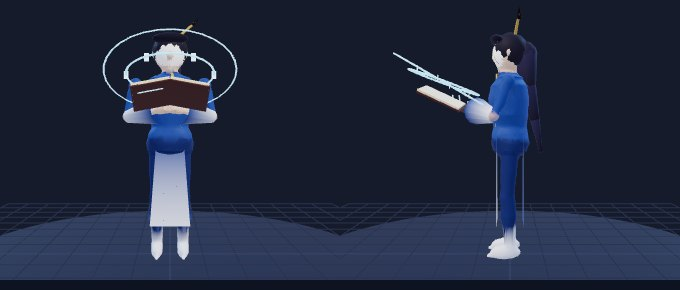

- **Ngoại hình model:** Nàng áo xanh lam viền vàng, bút cài tóc, cuốn sách cổ mở lơ lửng, vòng chữ phát sáng.
- **File:** `assets/heroes/thu_linh/thu_linh.glb` (699 KB) · sinh bằng code (`tools/modelgen/heroes/thu_linh.mjs`, màu theo đỉnh, chưa texture)
- **Thông số:** 10,192 tam giác · 25 xương · 3 vật liệu · cao 170 cm · runRefSpeed 315
- **Màu:** viền sáng `#7ad0ff` · bảng màu `#2a5aa8` `#7ad0ff` `#f6ecd0` `#d9b25a`
- **Clip (11):** Idle, Run, Attack1, Attack2, Cast1, Cast2, Ult, Death, Recall, Victory, Showcase

### 17. Kiếm Thuỷ — "Kiếm Sĩ Sông Xanh" `kiem_thuy`

**Trạng thái:** 🔜 Sắp có (khoá trong màn chọn tướng) · **Vai:** Đấu sĩ / Sát thủ · **Đường:** Đền, Rừng · **Độ khó:** ★★★ · **Đánh thường:** cận chiến

*Cơ chế: đổi thế kiếm theo dòng nước; tích Ấn rồi tung chuỗi mười ba nhát.*

| | | | | | | | |
|---|---|---|---|---|---|---|---|
| HP 860 (+102) | Mana 300 (+32) | Công 70 (+6.8) | Giáp 28 (+3.4) | KP 28 (+1.9) | Tốc đánh 0.7 (+2.5%/cấp) | Chạy 325 | Tầm 175 |

- **Nội tại – Thế Thuỷ** `the_thuy`: Mỗi kỹ năng chuyển sang thế kế tiếp: Sông (+15% tốc chạy), Thác (+20% sát thương đòn kế), Xoáy (làm chậm 20% 1s). Kỹ năng trúng tướng +1 Ấn (tối đa 5).
- **K1 – Nhát Sông** `nhat_song` · kiểu `line` · tầm 500, rộng 130
  - Hồi chiêu: 5/4.7/4.4/4.1/3.8/3.5s · Tiêu hao: 30/30/35/35/40/40 mana
  - Sát thương: 45 (+25/cấp) + 0.6 Công VL
  - Mô tả: Hai nhát chém liên tiếp theo hướng.
- **K2 – Bánh Xe Nước** `banh_xe_nuoc` · kiểu `aoeSelf` · bán kính 300
  - Hồi chiêu: 9/8.5/8/7.5/7/6.5s · Tiêu hao: 50/50/55/55/60/60 mana
  - Sát thương: 80 (+40/cấp) + 0.8 Công VL
  - Hiệu ứng: đẩy lùi 100
  - Mô tả: Xoay kiếm quanh mình, hất lùi nhẹ.
- **K3 (chiêu cuối) – Nhật Vũ Mười Ba Thức** `nhat_vu` · kiểu `dash` · tầm 700
  - Hồi chiêu: 60/50/40s · Tiêu hao: 0 mana
  - Sát thương: 30 (+20/cấp) + 0.35 Công VL
  - Điều kiện: Ấn đủ 5
  - Mô tả: Cần đủ 5 Ấn: lướt và chém 13 nhát liên hoàn, nhát cuối gây thêm 50%.
- **Bot:** combo K1 → K2 → K3 · giữ cự ly 180 · vào giao tranh khi HP ≥ 75%
- **Phép mặc định:** Chớp Bước · **Build:** Giày Chiến → ⚠️`kiem_nhanh` (không có trong items.js) → Huyết Kiếm → Khiên Đá → Thương Phá Giáp → Mặt Nạ Hồi Sinh

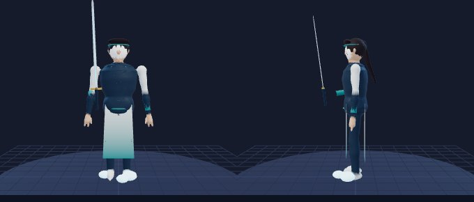

- **Ngoại hình model:** Kiếm sĩ băng đô xanh, áo khoác trắng viền sóng nước tà dài, kiếm thẳng lưỡi xanh nước, bọt nước quanh chân.
- **File:** `assets/heroes/kiem_thuy/kiem_thuy.glb` (703 KB) · sinh bằng code (`tools/modelgen/heroes/kiem_thuy.mjs`, màu theo đỉnh, chưa texture)
- **Thông số:** 10,512 tam giác · 25 xương · 3 vật liệu · cao 185 cm · runRefSpeed 325
- **Màu:** viền sáng `#6ad4ff` · bảng màu `#e8f2f0` `#2a9a9a` `#1a3a52` `#6ad4ff`
- **Clip (11):** Idle, Run, Attack1, Attack2, Cast1, Cast2, Ult, Death, Recall, Victory, Showcase

### 18. Lưỡng Cực — "Đạo Sĩ Âm Dương" `luong_cuc`

**Trạng thái:** 🔜 Sắp có (khoá trong màn chọn tướng) · **Vai:** Pháp sư · **Đường:** Giữa · **Độ khó:** ★★★ · **Đánh thường:** đạn bay (tốc 1800, vfx `yin_yang`)

*Cơ chế: điều khiển không gian — hút, đẩy, rồi hợp Thái Cực; chiêu cuối mở cõi giam địch.*

| | | | | | | | |
|---|---|---|---|---|---|---|---|
| HP 650 (+80) | Mana 470 (+46) | Công 50 (+3.2) | Giáp 21 (+2.8) | KP 28 (+1.6) | Tốc đánh 0.62 (+1.2%/cấp) | Chạy 315 | Tầm 520 |

- **Nội tại – Vô Hạn** `vo_han`: Đòn đánh của Lưỡng Cực không bị chặn bởi đạn/khiên đường bay; +10% tốc chạy khi không có địch trong 700.
- **K1 – Âm Hút** `am_hut` · kiểu `aoeCircle` · tầm 750, bán kính 230, trễ 0.4s
  - Hồi chiêu: 9/8.5/8/7.5/7/6.5s · Tiêu hao: 60/60/65/65/70/70 mana
  - Sát thương: 60 (+30/cấp) + 0.5 Phép P
  - Hiệu ứng: kéo 260
  - Mô tả: Hút địch về tâm vùng.
- **K2 – Dương Đẩy** `duong_day` · kiểu `aoeCircle` · tầm 750, bán kính 230, trễ 0.4s
  - Hồi chiêu: 9/8.5/8/7.5/7/6.5s · Tiêu hao: 60/60/65/65/70/70 mana
  - Sát thương: 60 (+30/cấp) + 0.5 Phép P
  - Hiệu ứng: đẩy lùi 300
  - Mô tả: Đẩy văng địch; tung sau Âm Hút trong 3s thì hợp Chùm Thái Cực.
- **K3 (chiêu cuối) – Thái Cực Giới** `thai_cuc_gioi` · kiểu `zone` · tầm 700, bán kính 520, kéo dài 4s
  - Hồi chiêu: 100/90/80s · Tiêu hao: 140 mana
  - Sát thương: 30 (+20/cấp) + 0.25 Phép P
  - Hiệu ứng: câm lặng 0.6s, chậm 60% 0.6s
  - Mô tả: Mở cõi 4s: địch trong vùng bị câm lặng và chậm mạnh; Lưỡng Cực không bị chọn làm mục tiêu bởi đòn đánh thường trong lúc mở.
- **Bot:** combo K1 → K2 → K3 · giữ cự ly 540 · vào giao tranh khi HP ≥ 90%
- **Phép mặc định:** Chớp Bước · **Build:** Giày Pháp Sư → Trượng Sông → Mũ Sấm → Sách Phá Giới → Bình Sương Đông → Ngọc Băng

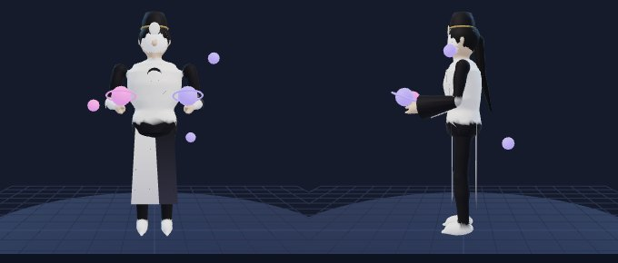

- **Ngoại hình model:** Đạo sĩ mũ đạo cao đen, mặt nạ gỗ đội trán, áo chia nửa đen nửa trắng có biểu tượng âm dương, hai quả cầu Âm (đỏ→đen) và Dương (xanh→trắng) trên tay.
- **File:** `assets/heroes/luong_cuc/luong_cuc.glb` (716 KB) · sinh bằng code (`tools/modelgen/heroes/luong_cuc.mjs`, màu theo đỉnh, chưa texture)
- **Thông số:** 10,602 tam giác · 25 xương · 3 vật liệu · cao 185 cm · runRefSpeed 315
- **Màu:** viền sáng `#8a7aff` · bảng màu `#f4f4f0` `#16161e` `#6a7aff` `#ff5a6a`
- **Clip (11):** Idle, Run, Attack1, Attack2, Cast1, Cast2, Ult, Death, Recall, Victory, Showcase

### 19. Nhãn Sư — "Thợ Săn Thấu Nhãn" `nhan_su`

**Trạng thái:** 🔜 Sắp có (khoá trong màn chọn tướng) · **Vai:** Xạ thủ / Sát thủ · **Đường:** Sông · **Độ khó:** ★★★ · **Đánh thường:** đạn bay (tốc 2000, vfx `bolt`)

*Cơ chế: tích Tầm Nhìn bằng thông tin, đủ 100 thì thấy điểm yếu và tung loạt bắn quyết định.*

| | | | | | | | |
|---|---|---|---|---|---|---|---|
| HP 640 (+78) | Mana 300 (+30) | Công 66 (+5.5) | Giáp 22 (+3) | KP 26 (+1.5) | Tốc đánh 0.75 (+3%/cấp) | Chạy 330 | Tầm 500 |

- **Nội tại – Tầm Nhìn** `tam_nhin`: Tích Tầm Nhìn khi thấy tướng địch (tối đa 27/giây, dừng khi bị khống chế cứng). Đủ 100: Thấu Nhãn — lộ điểm yếu địch, +12% tốc chạy, né đòn trực tiếp đầu tiên.
- **K1 – Chạy Mù Điểm** `chay_mu_diem` · kiểu `dash` · tầm 450
  - Hồi chiêu: 9/8.5/8/7.5/7/6.5s · Tiêu hao: 40/40/45/45/50/50 mana
  - Hiệu ứng: đổi chỉ số slowImmune true dmgReducePct +30% 1s
  - Mô tả: Chạy vòng sườn: giảm 30% sát thương, miễn nhiễm làm chậm 1s; phát bắn kế tiếp được nạp.
- **K2 – Phát Bắn Thẳng** `phat_ban_thang` · kiểu `skillshot` · tầm 900, rộng 55, tốc đạn 2600
  - Hồi chiêu: 7/6.6/6.2/5.8/5.4/5s · Tiêu hao: 50/50/55/55/60/60 mana
  - Sát thương: 62 (+30/cấp) + 0.9 Công VL
  - Mô tả: Phát bắn chính xác; đúng thời điểm (sau Chạy Mù Điểm) gây 80 và làm địch ngã ngắn.
- **K3 (chiêu cuối) – Hai Nòng Liên Xạ** `hai_nong_lien_xa` · kiểu `skillshot` · tầm 1000, rộng 80, tốc đạn 3000
  - Hồi chiêu: 55/47/40s · Tiêu hao: 0 mana
  - Sát thương: 135 (+60/cấp) + 1 Công VL
  - Điều kiện: Tầm Nhìn 100
  - Mô tả: Cần Tầm Nhìn 100: loạt bắn 135 xuyên 15% giáp (157 nếu địch đang hở).
- **Bot:** combo K1 → K2 → K3 · giữ cự ly 500 · vào giao tranh khi HP ≥ 90%
- **Phép mặc định:** Chớp Bước · **Build:** ⚠️`giay_xa_thu` (không có trong items.js) → Cung Gió → ⚠️`kiem_nhanh` (không có trong items.js) → ⚠️`ao_giap_nhe` (không có trong items.js) → ⚠️`nhan_bao_kich` (không có trong items.js) → Mặt Nạ Hồi Sinh

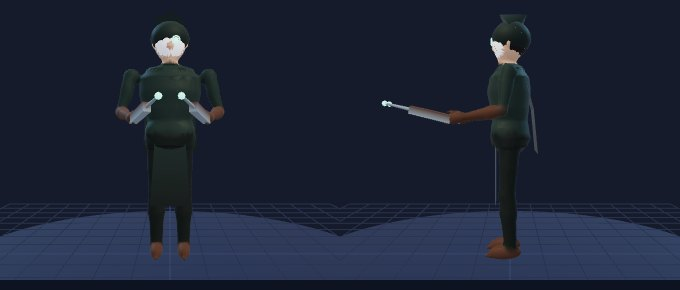

- **Ngoại hình model:** Thợ săn mũ trùm xanh rêu, một mắt thấu nhãn phát sáng ngọc, hai nỏ ngắn hai nòng ở hai tay.
- **File:** `assets/heroes/nhan_su/nhan_su.glb` (631 KB) · sinh bằng code (`tools/modelgen/heroes/nhan_su.mjs`, màu theo đỉnh, chưa texture)
- **Thông số:** 9,906 tam giác · 23 xương · 3 vật liệu · cao 180 cm · runRefSpeed 330
- **Màu:** viền sáng `#5affd0` · bảng màu `#22362e` `#5affd0` `#5a3a26` `#8a9aa0`
- **Clip (11):** Idle, Run, Attack1, Attack2, Cast1, Cast2, Ult, Death, Recall, Victory, Showcase

### 20. Trạng Nhí — "Thám Tử Nhí Phố Cổ" `trang_nhi`

**Trạng thái:** 🔜 Sắp có (khoá trong màn chọn tướng) · **Vai:** Xạ thủ / Trợ thủ · **Đường:** Sông · **Độ khó:** ★★ · **Đánh thường:** đạn bay (tốc 1800, vfx `pebble`)

*Cơ chế: dùng bảo bối phá án — giày đá bóng, kim gây mê, ván trượt, ghép manh mối để kết án.*

| | | | | | | | |
|---|---|---|---|---|---|---|---|
| HP 620 (+78) | Mana 300 (+30) | Công 66 (+5.5) | Giáp 22 (+3) | KP 26 (+1.5) | Tốc đánh 0.75 (+3%/cấp) | Chạy 335 | Tầm 500 |

- **Nội tại – Manh Mối** `manh_moi`: Mỗi kỹ năng trúng đánh dấu 1 Manh Mối lên địch (8s, tối đa 3). Đòn đánh vào mục tiêu có Manh Mối gây thêm 15 (+0.2 Công) sát thương chuẩn.
- **K1 – Đá Bóng Giày Lực** `da_bong_giay_luc` · kiểu `skillshot` · tầm 850, rộng 70, tốc đạn 2000
  - Hồi chiêu: 6/5.6/5.2/4.8/4.4/4s · Tiêu hao: 40/40/45/45/50/50 mana
  - Sát thương: 75 (+38/cấp) + 0.9 Công VL
  - Hiệu ứng: đẩy lùi 120
  - Mô tả: Đá quả bóng bằng giày tăng lực, đẩy lùi nhẹ.
- **K2 – Đồng Hồ Kim Mê** `dong_ho_kim_me` · kiểu `skillshot` · tầm 800, rộng 40, tốc đạn 2400
  - Hồi chiêu: 12/11.3/10.6/9.9/9.2/8.5s · Tiêu hao: 50/50/55/55/60/60 mana
  - Sát thương: 30 (+15/cấp) + 0.3 Công VL
  - Hiệu ứng: choáng 1s
  - Mô tả: Bắn kim gây mê: choáng 1s.
- **K3 (chiêu cuối) – Chân Lý Duy Nhất** `chan_ly_duy_nhat` · kiểu `targetedDash` · tầm 800
  - Hồi chiêu: 65/55/45s · Tiêu hao: 100 mana
  - Sát thương: 200 (+100/cấp) + 1.1 Công C
  - Điều kiện: Mục tiêu có ít nhất 2 Manh Mối
  - Mô tả: Kết án mục tiêu có từ 2 Manh Mối: sát thương chuẩn, mỗi Manh Mối cộng thêm 15%; trượt thì không mất Manh Mối.
- **Bot:** combo K2 → K1 → K3 · giữ cự ly 500 · vào giao tranh khi HP ≥ 85%
- **Phép mặc định:** Chớp Bước · **Build:** ⚠️`giay_xa_thu` (không có trong items.js) → Cung Gió → ⚠️`kiem_nhanh` (không có trong items.js) → ⚠️`ao_giap_nhe` (không có trong items.js) → ⚠️`nhan_bao_kich` (không có trong items.js) → Mặt Nạ Hồi Sinh

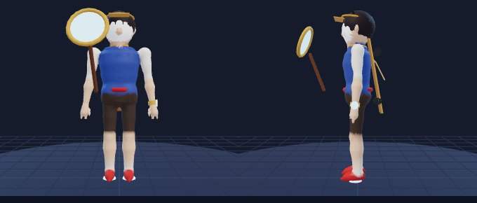

- **Ngoại hình model:** Thám tử nhí (1.35 m), mũ lưỡi trai, giày lực phát sáng, đồng hồ kim ở cổ tay trái, kính lúp lớn tay phải, ván trượt sau lưng.
- **File:** `assets/heroes/trang_nhi/trang_nhi.glb` (640 KB) · sinh bằng code (`tools/modelgen/heroes/trang_nhi.mjs`, màu theo đỉnh, chưa texture)
- **Thông số:** 10,088 tam giác · 22 xương · 3 vật liệu · cao 135 cm · runRefSpeed 335
- **Màu:** viền sáng `#7ad8ff` · bảng màu `#3a5aa8` `#e0a030` `#f4f0e4` `#c8302a`
- **Clip (11):** Idle, Run, Attack1, Attack2, Cast1, Cast2, Ult, Death, Recall, Victory, Showcase

## 4. ⏳ Tướng trong hàng chờ (10)

### 21. Trâu Đồng — "Chiến Binh Trống Trận" (Đỡ đòn) `trau_dong`

**Trạng thái:** ⏳ Hàng chờ — có thiết kế (docs/04 §6.2) + model 3D, **chưa có file dữ liệu** `src/data/heroes/trau_dong.js` · **Vai:** Đỡ đòn / Đấu sĩ · **Đường:** Đền · **Độ khó:** ★

| | | | | | | | |
|---|---|---|---|---|---|---|---|
| HP 1020 (+125) | Mana 300 (+30) | Công 62 (+5) | Giáp 34 (+4) | KP 32 (+2) | Tốc đánh 0.64 (+1.5%/cấp) | Chạy 315 | Tầm 170 |

Cơ chế cốt lõi: **càng bị vây càng lì, đẩy địch vào tường để choáng.**
- **Nội tại – Da Đồng:** giảm 8% sát thương nhận khi có 2 tướng địch trong 600; 15% khi có từ 3 tướng.
- **K1 – Rống Trống** (`aoeSelf`, bán kính 320, CD 9s, 45 mana): `80 (+40) +5% HP` P, giảm tốc đánh địch 25% trong 2.5s.
- **K2 – Sừng Húc** (`dash`, 500, `stopOnHero`, CD 11/10.5/10/9.5/9/8.5s, 55 mana): mục tiêu chịu `90 (+45) +0.8 Công` VL và bị đẩy lùi 300. **Nếu đụng tường: choáng 1.25s**, nếu không: choáng 0.5s.
- **K3 – Đại Trống Đồng** (`aoeSelf`, bán kính 450, trễ 0.5s, CD 65/58/50s, 100 mana): hất tung 1s, `200 (+100) +8% HP` P; bản thân giảm 30% sát thương nhận trong 4s.
- Combo bot: K2 (ưu tiên hướng có tường sau lưng mục tiêu) → K3 → K1. Phép: Chớp Bước.
- Build: `giay_chien, khien_da, giap_gai, tim_co_thu, ao_choang_suong, mat_na_hoi_sinh`.

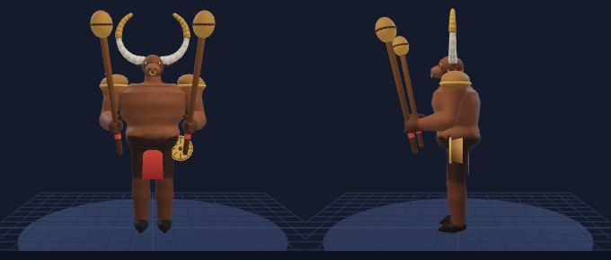

- **Ngoại hình model:** chiến binh nửa người nửa trâu, sừng cong lớn bọc đồng, ngực trần xăm hoa văn chim Lạc, đeo trống đồng nhỏ bên hông, khố và giáp vai đồng thau. Vũ khí: hai dùi trống lớn bằng đồng (dùng như chuỳ).
- **File:** `assets/heroes/trau_dong/trau_dong.glb` (925 KB) · sinh bằng code (`tools/modelgen/heroes/trau_dong.mjs`, màu theo đỉnh, chưa texture)
- **Thông số:** 15,008 tam giác · 20 xương · 1 vật liệu · cao 225 cm · runRefSpeed 315
- **Màu:** viền sáng `#d9a441` · bảng màu `#8a5a2b` `#d9a441` `#3a2418` `#e0513b`
- **Clip (11):** Idle, Run, Attack1, Attack2, Cast1, Cast2, Ult, Death, Recall, Victory, Showcase

### 22. Cổ Thụ — "Cây Đa Nghìn Tuổi" (Đỡ đòn / Trợ thủ) `co_thu`

**Trạng thái:** ⏳ Hàng chờ — có thiết kế (docs/04 §6.3) + model 3D, **chưa có file dữ liệu** `src/data/heroes/co_thu.js` · **Vai:** Đỡ đòn / Trợ thủ · **Đường:** Hỗ trợ · **Độ khó:** ★★

| | | | | | | | |
|---|---|---|---|---|---|---|---|
| HP 980 (+125) | Mana 380 (+40) | Công 52 (+3.5) | Giáp 34 (+4) | KP 34 (+2.4) | Tốc đánh 0.60 (+1.2%/cấp) | Chạy 305 | Tầm 180 |

Cơ chế cốt lõi: **trói diện rộng, đứng yên để hồi máu.**
- **Nội tại – Rễ Sâu:** đứng yên 1.5s thì hồi 1.5% HP tối đa mỗi giây; mất khi di chuyển.
- **K1 – Rễ Trói** (`skillshot`, 750, rộng 90, CD 11/10.5/10/9.5/9/8.5s, 60 mana): tướng đầu tiên trúng chịu `70 (+35) +0.4 Phép` P và bị trói 1.25s.
- **K2 – Tán Lá** (`allyTarget`, 650, CD 12s, 70 mana): khiên `100 (+50) +6% HP của Cổ Thụ` trong 3s cho mục tiêu; nếu mục tiêu là đồng minh, Cổ Thụ cũng nhận 50%.
- **K3 – Rừng Già** (`zone`, tầm 750, bán kính 450, 3s, CD 70/62/54s, 120 mana): địch trong vùng bị chậm 50%; hết 3s, địch còn trong vùng chịu `150 (+75) +0.6 Phép` P và bị trói 1s.
- Combo bot: K3 → K1 → K2 cho đồng minh máu thấp nhất. Phép: Hồi Phục.
- Build: `giay_tinh_tam, den_dong_hanh, giap_den_long, tim_co_thu, khien_da, ao_choang_suong`.

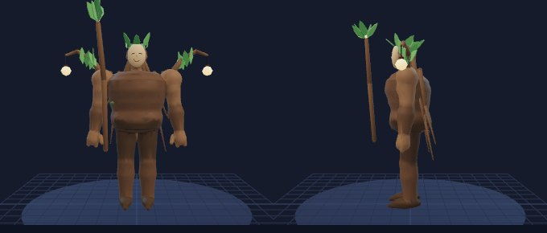

- **Ngoại hình model:** thực thể cây đa hình người, thân vỏ cây xoắn, rễ phụ buông như tóc và áo choàng, mặt nạ gỗ hiền từ, đèn lồng nhỏ treo trên cành vai. Vũ khí: gậy gỗ mọc lá ở đầu.
- **File:** `assets/heroes/co_thu/co_thu.glb` (1255 KB) · sinh bằng code (`tools/modelgen/heroes/co_thu.mjs`, màu theo đỉnh, chưa texture)
- **Thông số:** 12,560 tam giác · 44 xương · 2 vật liệu · cao 240 cm · runRefSpeed 305
- **Màu:** viền sáng `#8fdc70` · bảng màu `#5a4030` `#6fae5a` `#ffd27a` `#2d3b2a`
- **Clip (11):** Idle, Run, Attack1, Attack2, Cast1, Cast2, Ult, Death, Recall, Victory, Showcase

### 23. Kiếm Mây — "Kiếm Khách Trên Mây" (Đấu sĩ / Sát thủ) `kiem_may`

**Trạng thái:** ⏳ Hàng chờ — có thiết kế (docs/04 §6.5) + model 3D, **chưa có file dữ liệu** `src/data/heroes/kiem_may.js` · **Vai:** Đấu sĩ / Sát thủ · **Đường:** Đền, Rừng · **Độ khó:** ★★★

| | | | | | | | |
|---|---|---|---|---|---|---|---|
| HP 820 (+98) | Mana Không | Công 70 (+7) | Giáp 28 (+3.4) | KP 28 (+1.8) | Tốc đánh 0.70 (+2.5%/cấp) | Chạy 330 | Tầm 170 |

Cơ chế cốt lõi: **ba nhịp lướt liên tiếp và đỡ đòn đúng lúc.**
- **Nội tại – Mây Theo Gió:** sau mỗi kỹ năng, đòn đánh kế tiếp trong 3s gây thêm 30% sát thương và lướt ngắn 120 tới mục tiêu.
- **K1 – Mây Cuốn** (`recast` ×3, `dash` 320 mỗi lần, cửa sổ 3s, CD 9/8.5/8/7.5/7/6.5s, Không): mỗi lần `50 (+25) +0.7 Công` VL lên địch trên đường. **Lần 3 hất tung 0.5s.**
- **K2 – Kiếm Chắn** (`selfBuff`, CD 14/13/12/11/10/9s): trong 1.2s, chặn đòn đánh thường hoặc kỹ năng đơn mục tiêu đầu tiên. Chặn thành công: choáng kẻ tấn công nếu trong 400 trong 1s, hoàn 50% hồi chiêu K2.
- **K3 – Nhất Kiếm Thiên Vân** (`targetedDash`, 600, CD 45/38/30s): không thể bị chọn 0.6s, lao tới tướng địch, gây `200 (+120) +1.2 Công thêm +15% HP đã mất của mục tiêu` VL.
- Combo bot: K1×2 → K3 khi mục tiêu < 45% HP → K1 lần 3; K2 khi thấy đạn/kỹ năng đơn mục tiêu nhắm vào mình. Phép: Trảm Hồn (Rừng: Thu Hoạch).
- Build: `giay_toc_chien, thuong_pha_giap, luoi_huyet_nguyet, huyet_kiem, khien_da, mat_na_hoi_sinh`.

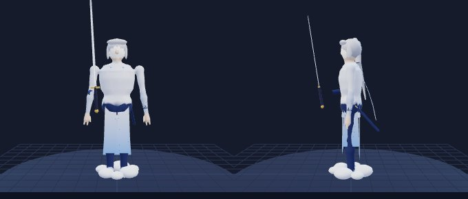

- **Ngoại hình model:** kiếm khách thanh mảnh, áo dài xẻ tà trắng xanh, khăn lụa dài bay theo gió, tóc bạc buộc nửa, mặt lạnh lùng, có mảnh mây ngưng tụ quanh chân. Vũ khí: thanh kiếm mảnh dài, lưỡi có vân mây.
- **File:** `assets/heroes/kiem_may/kiem_may.glb` (891 KB) · sinh bằng code (`tools/modelgen/heroes/kiem_may.mjs`, màu theo đỉnh, chưa texture)
- **Thông số:** 11,812 tam giác · 32 xương · 3 vật liệu · cao 190 cm · runRefSpeed 330
- **Màu:** viền sáng `#9fd0ff` · bảng màu `#eaf2ff` `#7fb6ff` `#2c3e70` `#c0c8d8`
- **Clip (11):** Idle, Run, Attack1, Attack2, Cast1, Cast2, Ult, Death, Recall, Victory, Showcase

### 24. Sói Núi — "Kẻ Tru Dưới Trăng" (Đấu sĩ) `soi_nui`

**Trạng thái:** ⏳ Hàng chờ — có thiết kế (docs/04 §6.6) + model 3D, **chưa có file dữ liệu** `src/data/heroes/soi_nui.js` · **Vai:** Đấu sĩ · **Đường:** Rừng, Đền · **Độ khó:** ★★

| | | | | | | | |
|---|---|---|---|---|---|---|---|
| HP 860 (+102) | Mana Không | Công 72 (+7) | Giáp 27 (+3.3) | KP 27 (+1.8) | Tốc đánh 0.72 (+2.8%/cấp) | Chạy 335 | Tầm 160 |

Cơ chế cốt lõi: **càng mất máu càng hút máu mạnh.**
- **Nội tại – Khát Máu:** cứ mỗi 10% HP đã mất: +2% hút máu và +3% tốc đánh (tối đa +16% hút máu, +24% tốc đánh).
- **K1 – Vồ Mồi** (`dash` tới điểm, 500, CD 8/7.5/7/6.5/6/5.5s, Không): `70 (+35) +0.8 Công` VL lên mục tiêu gần điểm rơi nhất trong 200, làm chậm 30% 1s.
- **K2 – Tru Trăng** (`aoeSelf`, bán kính 400, CD 12s): địch bị chậm 40% 1.5s và giảm 20% giáp trong 4s.
- **K3 – Cuồng Nộ** (`selfBuff`, CD 70/60/50s): 7s: +40/55/70% tốc đánh, +20% tốc chạy, +10% hút máu, to lên 20%. 2s đầu HP không thể xuống dưới 1.
- Combo bot: K1 → K2 → K3 khi giao tranh có ≥ 2 địch. Phép: Thu Hoạch khi đi Rừng, Trảm Hồn khi đi Đền.
- Build: `nanh_thu_rung (nếu Rừng), giay_toc_chien, huyet_kiem, cung_gio, khien_da, mat_na_hoi_sinh`.

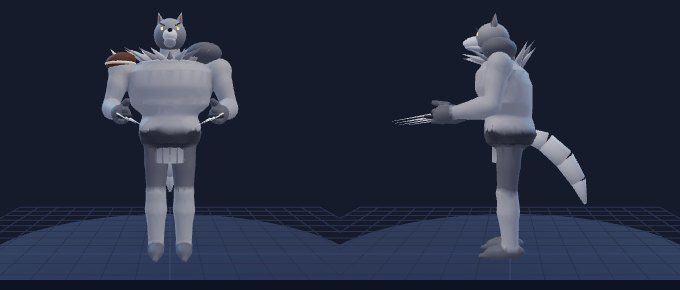

- **Ngoại hình model:** chiến binh người sói lông xám bạc, bờm dày, giáp da thú và xương, mắt vàng, móng vuốt kim loại. Vũ khí: đôi móng vuốt thép gắn trên găng.
- **File:** `assets/heroes/soi_nui/soi_nui.glb` (742 KB) · sinh bằng code (`tools/modelgen/heroes/soi_nui.mjs`, màu theo đỉnh, chưa texture)
- **Thông số:** 10,732 tam giác · 24 xương · 2 vật liệu · cao 205 cm · runRefSpeed 335
- **Màu:** viền sáng `#ffcc33` · bảng màu `#8c8f99` `#3a3d48` `#ffcc33` `#a33a2a`
- **Clip (11):** Idle, Run, Attack1, Attack2, Cast1, Cast2, Ult, Death, Recall, Victory, Showcase

### 25. Dơi Đêm — "Kẻ Săn Bằng Tiếng Vọng" (Sát thủ phép) `doi_dem`

**Trạng thái:** ⏳ Hàng chờ — có thiết kế (docs/04 §6.8) + model 3D, **chưa có file dữ liệu** `src/data/heroes/doi_dem.js` · **Vai:** Sát thủ / Pháp sư · **Đường:** Rừng, Giữa · **Độ khó:** ★★★

| | | | | | | | |
|---|---|---|---|---|---|---|---|
| HP 680 (+82) | Mana 380 (+40) | Công 55 (+4) | Giáp 22 (+3) | KP 28 (+1.8) | Tốc đánh 0.65 (+1.5%/cấp) | Chạy 340 | Tầm 450 |

Cơ chế cốt lõi: **đánh dấu rồi kích nổ, lướt lại khi hạ gục.**
- **Nội tại – Tiếng Vọng:** kỹ năng trúng tướng để lại Dấu Vọng 4s. Kỹ năng kế tiếp trúng mục tiêu có dấu sẽ kích nổ thêm `40 (+10/cấp tướng) +0.3 Phép` P.
- **K1 – Sóng Âm** (`cone`, 500, 60°, CD 6/5.6/5.2/4.8/4.4/4s, 50 mana): `90 (+45) +0.6 Phép` P.
- **K2 – Bay Vút** (`dash`, 550, không thể bị chọn khi lướt, CD 12/11/10/9/8/7s, 60 mana): `60 (+30) +0.4 Phép` P lên địch trên đường. **Hạ gục hoặc hỗ trợ trong 3s sau khi dùng: làm mới hồi chiêu K2.**
- **K3 – Đàn Dơi** (`targetedDash`, 700, CD 50/42/34s, 100 mana): hoá bầy dơi không thể bị chọn 1s, xuất hiện cạnh mục tiêu gây `300 (+150) +1.0 Phép` P và câm lặng 1s.
- Combo bot: K1 → K3 → K1 → K2 (vào hoặc ra). Phép: Thu Hoạch (Rừng) / Chớp Bước (Giữa).
- Build: `giay_phap_su, sach_pha_gioi, nhan_huyet_phach, mu_sam, binh_suong_dong, truong_song`.

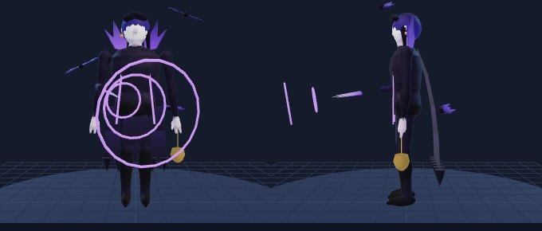

- **Ngoại hình model:** thanh niên tóc đen tím, áo choàng cổ cao có viền như cánh dơi, mắt nhắm (dùng tiếng vọng để "nhìn"), tai đeo khuyên chuông nhỏ. Vũ khí: chuông đồng nhỏ và sóng âm; tay phải có móng dài.
- **File:** `assets/heroes/doi_dem/doi_dem.glb` (788 KB) · sinh bằng code (`tools/modelgen/heroes/doi_dem.mjs`, màu theo đỉnh, chưa texture)
- **Thông số:** 10,952 tam giác · 26 xương · 3 vật liệu · cao 185 cm · runRefSpeed 340
- **Màu:** viền sáng `#9a6bff` · bảng màu `#1b1330` `#7a4dff` `#c9b6ff` `#0a0712`
- **Clip (11):** Idle, Run, Attack1, Attack2, Cast1, Cast2, Ult, Death, Recall, Victory, Showcase

### 26. Sấm Trống — "Tay Trống Gọi Mưa" (Pháp sư) `sam_trong`

**Trạng thái:** ⏳ Hàng chờ — có thiết kế (docs/04 §6.10) + model 3D, **chưa có file dữ liệu** `src/data/heroes/sam_trong.js` · **Vai:** Pháp sư · **Đường:** Giữa · **Độ khó:** ★★

| | | | | | | | |
|---|---|---|---|---|---|---|---|
| HP 660 (+80) | Mana 460 (+46) | Công 52 (+3.2) | Giáp 21 (+2.8) | KP 28 (+1.6) | Tốc đánh 0.62 (+1.2%/cấp) | Chạy 315 | Tầm 520 |

Cơ chế cốt lõi: **tích điện rồi làm choáng, sét nảy qua nhiều mục tiêu.**
- **Nội tại – Tích Điện:** mỗi lần kỹ năng gây sát thương lên tướng: +1 Điện (tối đa 4, tồn tại 8s). Đủ 4: kỹ năng kế tiếp choáng mục tiêu 1s và xoá Điện.
- **K1 – Tia Sét Nảy** (`skillshot`, 750, `bounce` 3 lần trong 450, CD 6s, 55 mana): `80 (+40) +0.6 Phép` P, giảm 15% mỗi lần nảy.
- **K2 – Trống Gọi Mưa** (`aoeCircle`, tầm 700, bán kính 220, trễ 0.6s, CD 9/8.5/8/7.5/7/6.5s, 65 mana): `100 (+50) +0.7 Phép` P, làm chậm 30% 1s.
- **K3 – Bão Giông** (`zone`, `followCaster`, bán kính 550, 4s, tick 0.5s, CD 60/52/44s, 120 mana): mỗi tick sét đánh 1 địch ngẫu nhiên trong vùng (ưu tiên tướng, RNG có seed) `70 (+35) +0.3 Phép` P. Mỗi sét tính là một lần gây sát thương của kỹ năng cho Tích Điện.
- Combo bot: K2 → K1 → K3 khi ≥ 2 tướng địch trong 550. Phép: Chớp Bước.
- Build: `giay_tinh_tam, truong_song, sach_pha_gioi, mu_sam, nhan_huyet_phach, binh_suong_dong`.

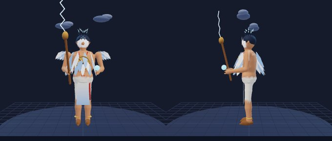

- **Ngoại hình model:** thầy cúng trẻ, mặt vẽ hoạ tiết mây sấm, áo choàng lông vũ, đeo trống đồng nhỏ trước ngực, tóc dựng như có điện. Vũ khí: trống đồng + dùi phát sét.
- **File:** `assets/heroes/sam_trong/sam_trong.glb` (910 KB) · sinh bằng code (`tools/modelgen/heroes/sam_trong.mjs`, màu theo đỉnh, chưa texture)
- **Thông số:** 12,146 tam giác · 22 xương · 3 vật liệu · cao 180 cm · runRefSpeed 315
- **Màu:** viền sáng `#5fd0ff` · bảng màu `#20304a` `#5fd0ff` `#d9a441` `#f1f1f1`
- **Clip (11):** Idle, Run, Attack1, Attack2, Cast1, Cast2, Ult, Death, Recall, Victory, Showcase

### 27. Hoa Độc — "Nàng Sen Đầm Độc" (Pháp sư / Trợ thủ) `hoa_doc`

**Trạng thái:** ⏳ Hàng chờ — có thiết kế (docs/04 §6.11) + model 3D, **chưa có file dữ liệu** `src/data/heroes/hoa_doc.js` · **Vai:** Pháp sư / Trợ thủ · **Đường:** Giữa, Hỗ trợ · **Độ khó:** ★★

| | | | | | | | |
|---|---|---|---|---|---|---|---|
| HP 650 (+80) | Mana 470 (+45) | Công 50 (+3) | Giáp 21 (+2.8) | KP 29 (+1.7) | Tốc đánh 0.62 (+1.2%/cấp) | Chạy 315 | Tầm 520 |

Cơ chế cốt lõi: **độc cộng dồn theo thời gian và vùng hồi máu cho đồng đội.**
- **Nội tại – Nhựa Độc:** kỹ năng gây độc 3s: `1.5% HP tối đa mục tiêu` P mỗi giây (tối đa 80/s lên quái). Trúng lại làm mới thời gian.
- **K1 – Hạt Độc** (`aoeCircle`, tầm 750, bán kính 180, trễ 0.4s, CD 4s, 45 mana): `70 (+35) +0.5 Phép` P.
- **K2 – Dây Leo** (`skillshot`, 700, rộng 80, CD 12/11.5/11/10.5/10/9.5s, 60 mana): `60 (+30) +0.4 Phép` P, trói 1s tướng đầu tiên.
- **K3 – Vườn Độc** (`zone`, tầm 800, bán kính 400, 5s, tick 1s, CD 70/62/54s, 120 mana): địch trong vùng chậm 30% và chịu `50 (+25) +0.2 Phép` P mỗi giây; đồng minh trong vùng hồi `20 (+10) +0.1 Phép` mỗi giây.
- Combo bot: K2 → K1 → K3. Phép: Chớp Bước (Giữa) / Hồi Phục (Hỗ trợ).
- Build: `giay_phap_su, ngoc_bang, truong_song, mu_sam, sach_pha_gioi, binh_suong_dong`.

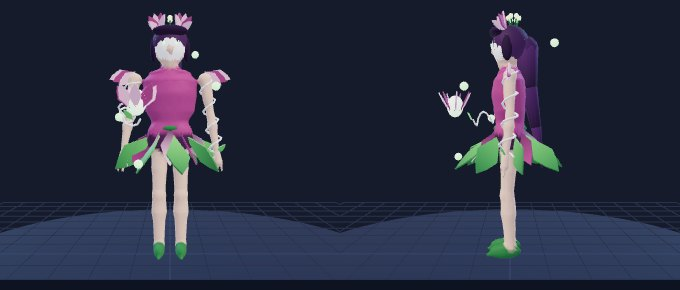

- **Ngoại hình model:** thiếu nữ trang phục cánh sen hồng tím, váy lá sen, tóc cài nhụy sen, dây leo quấn tay, đôi mắt xanh lục độc. Vũ khí: búp sen phát sáng trên tay.
- **File:** `assets/heroes/hoa_doc/hoa_doc.glb` (1097 KB) · sinh bằng code (`tools/modelgen/heroes/hoa_doc.mjs`, màu theo đỉnh, chưa texture)
- **Thông số:** 14,508 tam giác · 23 xương · 3 vật liệu · cao 168 cm · runRefSpeed 315
- **Màu:** viền sáng `#6bd36b` · bảng màu `#b24f8f` `#6bd36b` `#2a1a2e` `#f6c6e0`
- **Clip (11):** Idle, Run, Attack1, Attack2, Cast1, Cast2, Ult, Death, Recall, Victory, Showcase

### 28. Pháo Hoa — "Cô Nàng Pháo Tết" (Xạ thủ) `phao_hoa`

**Trạng thái:** ⏳ Hàng chờ — có thiết kế (docs/04 §6.13) + model 3D, **chưa có file dữ liệu** `src/data/heroes/phao_hoa.js` · **Vai:** Xạ thủ · **Đường:** Sông · **Độ khó:** ★★

| | | | | | | | |
|---|---|---|---|---|---|---|---|
| HP 610 (+80) | Mana 300 (+30) | Công 62 (+6.2) | Giáp 20 (+2.8) | KP 26 (+1.5) | Tốc đánh 0.70 (+3%/cấp) | Chạy 320 | Tầm 580 |

Cơ chế cốt lõi: **đòn đánh lan, chiêu cuối bắn xuyên bản đồ.**
- **Nội tại – Ngòi Nổ:** đòn đánh thường gây 30% sát thương lan bán kính 160 quanh mục tiêu (không lan lên công trình).
- **K1 – Pháo Chuột** (`skillshot`, 800, `explodeRadius` 200, CD 8/7.5/7/6.5/6/5.5s, 45 mana): `90 (+45) +0.9 Công` VL, làm chậm 30% 1s.
- **K2 – Nhảy Pháo** (`dash`, 450, CD 12/11/10/9/8/7s, 40 mana): để lại 3 quả pháo tại điểm xuất phát, nổ sau 1s bán kính 150, mỗi quả `40 (+20) +0.3 Công` VL.
- **K3 – Pháo Hoa Đêm** (`skillshot`, 3000, rộng 180, tốc 2200, trúng tướng đầu tiên, CD 75/65/55s, 100 mana): `250 (+125) +1.0 Công thêm` VL, +1% sát thương cho mỗi 1% HP đã mất của mục tiêu (tối đa +50%). Vẫn gây sát thương lên lính trên đường nhưng không dừng lại.
- Combo bot: K1 → đánh thường, K2 khi bị áp sát, K3 để kết liễu tướng địch < 30% HP trong tầm nhìn đội. Phép: Chớp Bước.
- Build: `giay_toc_chien, cung_gio, dao_trang_khuyet, thuong_pha_giap, huyet_kiem, mat_na_hoi_sinh`.

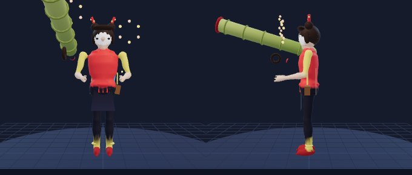

- **Ngoại hình model:** cô gái tinh nghịch, áo yếm đỏ phối áo khoác ngắn, tóc hai búi có pháo nhỏ cài, túi đeo đầy pháo, má dính muội. Vũ khí: ống phóng pháo bằng tre lớn vác vai.
- **File:** `assets/heroes/phao_hoa/phao_hoa.glb` (775 KB) · sinh bằng code (`tools/modelgen/heroes/phao_hoa.mjs`, màu theo đỉnh, chưa texture)
- **Thông số:** 12,214 tam giác · 22 xương · 3 vật liệu · cao 165 cm · runRefSpeed 320
- **Màu:** viền sáng `#f6e05e` · bảng màu `#e53e3e` `#f6e05e` `#1a1a2e` `#ffb3c1`
- **Clip (11):** Idle, Run, Attack1, Attack2, Cast1, Cast2, Ult, Death, Recall, Victory, Showcase

### 29. Trạng Nỏ — "Xạ Thủ Nỏ Đồng" (Xạ thủ) `trang_no`

**Trạng thái:** ⏳ Hàng chờ — có thiết kế (docs/04 §6.14) + model 3D, **chưa có file dữ liệu** `src/data/heroes/trang_no.js` · **Vai:** Xạ thủ · **Đường:** Sông · **Độ khó:** ★★

| | | | | | | | |
|---|---|---|---|---|---|---|---|
| HP 600 (+78) | Mana 320 (+32) | Công 66 (+6.4) | Giáp 19 (+2.7) | KP 26 (+1.5) | Tốc đánh 0.66 (+2.6%/cấp) | Chạy 315 | Tầm 680 |

Cơ chế cốt lõi: **tầm xa nhất, bẫy tre kiểm soát lối đi.**
- **Nội tại – Tầm Xa:** đòn đánh vào mục tiêu cách hơn 500 gây thêm 15% sát thương.
- **K1 – Tên Xuyên** (`skillshot`, 1000, xuyên, rộng 60, CD 8/7.5/7/6.5/6/5.5s, 45 mana): `100 (+50) +1.0 Công` VL, giảm 10% mỗi mục tiêu xuyên qua (tối thiểu 50%).
- **K2 – Bẫy Tre** (`trap`, tầm 500, tối đa 3 bẫy, tồn tại 40s, CD 14/13/12/11/10/9s, 40 mana): địch chạm bẫy bị trói 1.25s, lộ vị trí 3s, chịu `60 (+30) +0.4 Công` VL. Bẫy tàng hình với địch sau 1s.
- **K3 – Tam Tiễn** (`skillshot` ×3 hình nón 30°, 1200, CD 50/44/38s, 100 mana): mỗi mũi `150 (+80) +0.8 Công thêm` VL; mũi thứ 2 và 3 trúng cùng mục tiêu chỉ gây 50%.
- Combo bot: K2 đặt ở bụi/cửa rừng gần đường; K1 lên cụm lính có tướng phía sau; K3 khi mục tiêu bị trói/choáng. Phép: Chớp Bước.
- Build: `giay_toc_chien, dao_trang_khuyet, cung_gio, thuong_pha_giap, huyet_kiem, mat_na_hoi_sinh`.

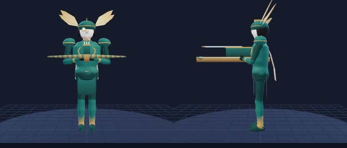

- **Ngoại hình model:** xạ thủ nữ lạnh lùng, áo giáp nhẹ đồng xanh (patina), mũ trụ nhỏ cánh chuồn, áo choàng ngắn, kính một mắt bằng đồng. Vũ khí: nỏ liên châu bằng đồng, lẫy chạm khắc.
- **File:** `assets/heroes/trang_no/trang_no.glb` (870 KB) · sinh bằng code (`tools/modelgen/heroes/trang_no.mjs`, màu theo đỉnh, chưa texture)
- **Thông số:** 12,462 tam giác · 27 xương · 3 vật liệu · cao 175 cm · runRefSpeed 315
- **Màu:** viền sáng `#7fe0d0` · bảng màu `#2f6f6a` `#d4a95f` `#1e2a2a` `#e8e0c8`
- **Clip (11):** Idle, Run, Attack1, Attack2, Cast1, Cast2, Ult, Death, Recall, Victory, Showcase

### 30. Mộc Cầm — "Nhạc Sư Đàn Tranh" (Trợ thủ / Pháp sư) `moc_cam`

**Trạng thái:** ⏳ Hàng chờ — có thiết kế (docs/04 §6.16) + model 3D, **chưa có file dữ liệu** `src/data/heroes/moc_cam.js` · **Vai:** Trợ thủ / Pháp sư · **Đường:** Hỗ trợ · **Độ khó:** ★★

| | | | | | | | |
|---|---|---|---|---|---|---|---|
| HP 700 (+92) | Mana 450 (+44) | Công 47 (+3) | Giáp 23 (+3) | KP 30 (+2) | Tốc đánh 0.62 (+1.2%/cấp) | Chạy 320 | Tầm 530 |

Cơ chế cốt lõi: **giai điệu tăng tốc đội, dây đàn trói rồi câm lặng diện rộng.**
- **Nội tại – Giai Điệu:** mỗi lần dùng kỹ năng, đồng minh trong 500 (gồm bản thân) +10% tốc chạy 1.5s.
- **K1 – Khúc Chữa Lành** (`aoeSelf`, bán kính 500, CD 10/9.5/9/8.5/8/7.5s, 70 mana): hồi `60 (+30) +0.4 Phép` cho đồng minh, bản thân nhận 50%.
- **K2 – Dây Đàn** (`tether`, `skillshot` 750, rộng 70, CD 12/11.5/11/10.5/10/9.5s, 60 mana): tướng địch đầu tiên trúng chịu `60 (+30) +0.4 Phép` P và bị nối dây 2s; nếu hết 2s vẫn trong 650: choáng 1.25s và chịu thêm lượng sát thương đó.
- **K3 – Khúc Tĩnh Lặng** (`aoeSelf`, bán kính 600, CD 65/58/50s, 110 mana): câm lặng địch 1.5s; đồng minh +30% tốc chạy 3s và được xoá hiệu ứng làm chậm.
- Combo bot: K2 → giữ khoảng cách → K3 khi địch lao vào; K1 khi tổng máu đã mất của đồng minh gần > 600. Phép: Hồi Phục.
- Build: `den_dong_hanh, giay_tinh_tam, ngoc_bang, giap_den_long, truong_song, ao_choang_suong`.

---

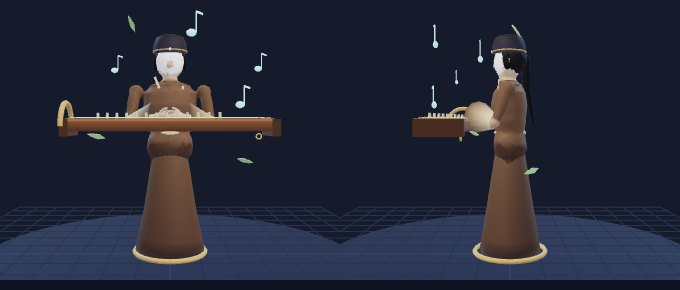

- **Ngoại hình model:** nhạc sư nam trẻ, áo the dài màu trà, khăn đóng, đàn tranh bay lơ lửng trước người, dây đàn phát sáng. Vũ khí: đàn tranh lơ lửng.
- **File:** `assets/heroes/moc_cam/moc_cam.glb` (810 KB) · sinh bằng code (`tools/modelgen/heroes/moc_cam.mjs`, màu theo đỉnh, chưa texture)
- **Thông số:** 12,058 tam giác · 23 xương · 3 vật liệu · cao 182 cm · runRefSpeed 315
- **Màu:** viền sáng `#7ad3c6` · bảng màu `#6b4f3a` `#e9d8a6` `#7ad3c6` `#2d2a32`
- **Clip (11):** Idle, Run, Attack1, Attack2, Cast1, Cast2, Ult, Death, Recall, Victory, Showcase
